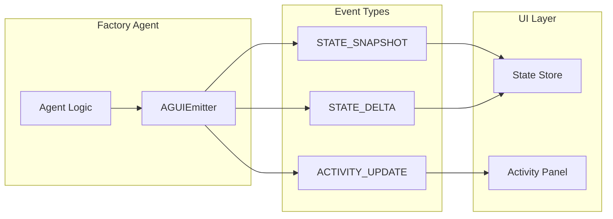
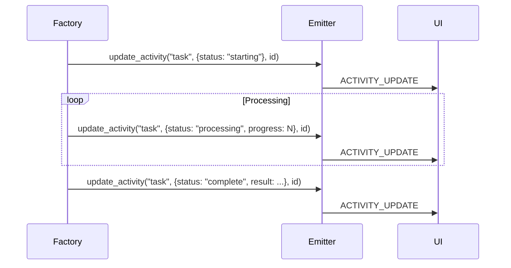
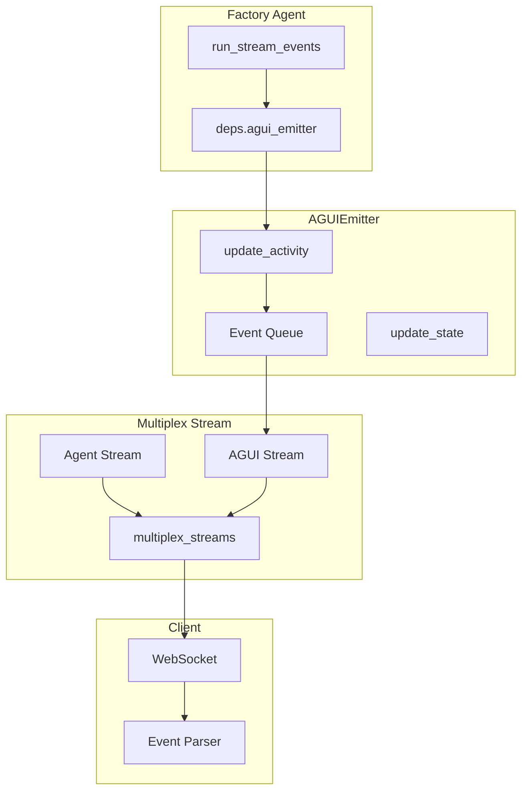

# AG-UI Protocol

AG-UI (Agent-GUI) is a protocol for streaming state updates from agents to user interfaces. Crazy Glue factory agents integrate with AG-UI via the `AGUIEmitter`.

## Protocol Overview



## Event Types

| Event | Purpose | Use Case |
|-------|---------|----------|
| `STATE_SNAPSHOT` | Full state replacement | Initial state, major changes |
| `STATE_DELTA` | Incremental updates | Field modifications |
| `ACTIVITY_UPDATE` | Progress tracking | Long-running operations |

## Using Activities (Recommended)

Activities are the **recommended** approach for factory agents due to timing issues with state snapshots.

### Basic Activity Update

```python
async def run_stream_events(self, ..., deps=None, **kwargs):
    # Get emitter from dependencies
    emitter = getattr(deps, "agui_emitter", None) if deps else None
    activity_id = str(uuid.uuid4())

    if emitter:
        # Update activity with current state
        emitter.update_activity("my_activity", {
            "status": "processing",
            "progress": 0,
            "message": "Starting..."
        }, activity_id)

    # Do work...

    if emitter:
        emitter.update_activity("my_activity", {
            "status": "complete",
            "progress": 100,
            "result": "Done!"
        }, activity_id)
```

### Activity Data Structure

Activities accept any JSON-serializable dictionary:

```python
emitter.update_activity("shark_tank", {
    "status": "analyzing",
    "phase": "market_analysis",
    "sharks": [
        {"name": "Marina Market", "status": "thinking"},
        {"name": "Trevor Tech", "status": "waiting"},
    ],
    "pitch": pitch_text[:100],
    "company": "DogMeet",
}, activity_id)
```

### Activity Lifecycle



## State Updates (Use with Caution)

!!! warning "Timing Race Condition"
    State snapshots may be rejected if `RUN_FINISHED` arrives before `STATE_SNAPSHOT` due to a race condition in `multiplex_streams`. **Use activities instead** for reliable UI updates in factory agents.

### State Snapshot

```python
# NOT RECOMMENDED for factory agents
emitter.update_state({
    "round": 1,
    "pro_score": 7.5,
    "con_score": 6.0,
})
```

### State Delta

```python
# NOT RECOMMENDED for factory agents
emitter.update_state_delta({
    "round": 2,  # Only changed fields
})
```

## Real-World Examples

### Debate Room Activities

```python
# Round progress
emitter.update_activity("debate", {
    "status": "pro_speaking",
    "round": round_num,
    "pro_score": pro_total,
    "con_score": con_total,
}, activity_id)

# Final result
emitter.update_activity("debate", {
    "status": "complete",
    "winner": "PRO",
    "topic": topic[:50],
    "total_rounds": num_rounds,
    "pro_score": 15.5,
    "con_score": 12.0,
}, activity_id)
```

### Code Review Room Activities

```python
# Review iteration
emitter.update_activity("code_review", {
    "status": "reviewed",
    "task": task,
    "round": round_num,
    "code": current_submission.code,
    "explanation": current_submission.explanation,
    "review": {
        "approved": last_review.approved,
        "issues": last_review.issues,
        "suggestions": last_review.suggestions,
        "praise": last_review.praise,
    },
}, activity_id)
```

### Shark Tank Room Activities

```python
# Parallel analysis phase
emitter.update_activity("shark_tank", {
    "status": "analyzing",
    "phase": "parallel_analysis",
    "pitch": pitch,
    "company": breakdown.company_name,
    "sharks": [
        {"name": "Marina Market", "focus": "Market", "status": "analyzing"},
        {"name": "Trevor Tech", "focus": "Technology", "status": "analyzing"},
        {"name": "Morgan Money", "focus": "Financials", "status": "analyzing"},
        {"name": "Rita Risk", "focus": "Risks", "status": "analyzing"},
    ],
}, activity_id)

# Final verdict
emitter.update_activity("shark_tank", {
    "status": "complete",
    "verdict": "FUNDED",
    "investors": ["Marina Market", "Trevor Tech"],
    "total_investment": 500000,
    "total_equity": 20,
    "valuation_implied": 2500000,
}, activity_id)
```

## Best Practices

### Do

- Use activities for all progress updates
- Include meaningful status strings
- Provide full context in each update (UI may join mid-stream)
- Use unique activity IDs per execution

### Don't

- Don't use state snapshots/deltas in factory agents
- Don't rely on event ordering
- Don't send partial data expecting delta updates
- Don't forget to handle missing emitter (`if emitter:`)

## Architecture



## Debugging

Enable debug logging to see AG-UI events:

```python
import logging
logging.getLogger("soliplex.agui").setLevel(logging.DEBUG)
```

Monitor events in browser DevTools Network tab (WebSocket messages).
