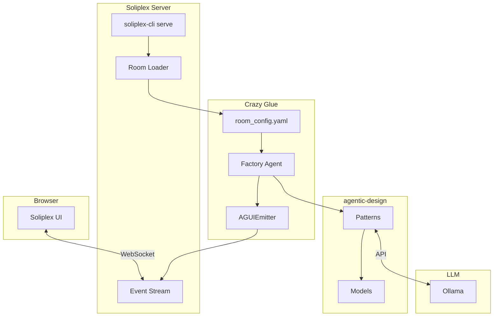
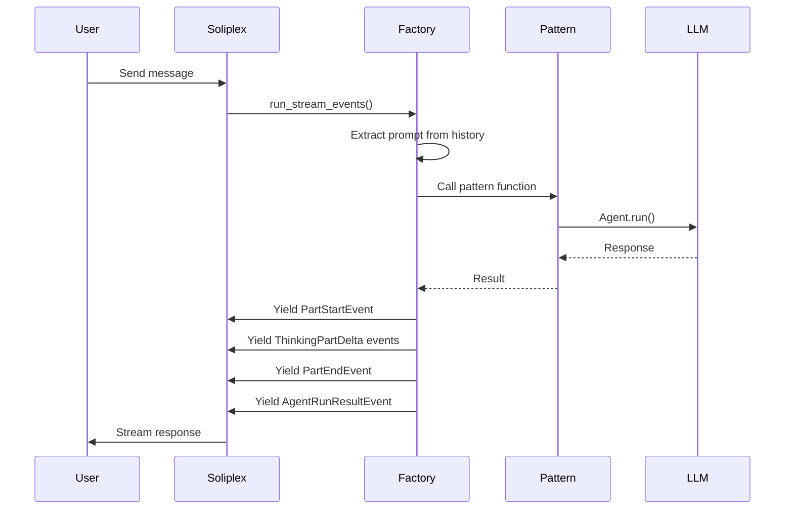
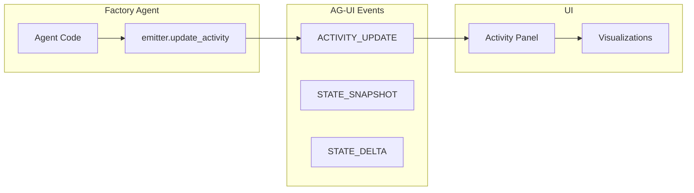
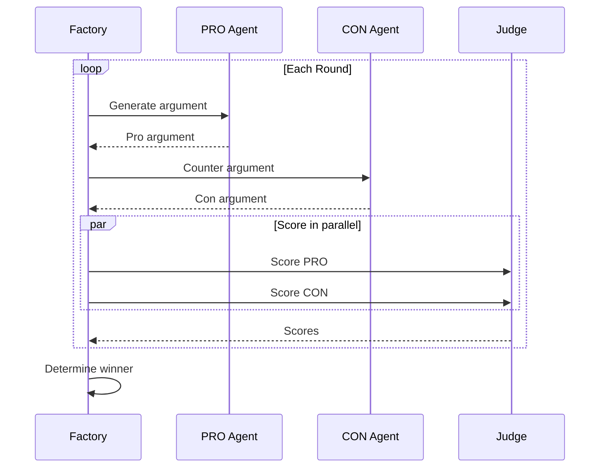
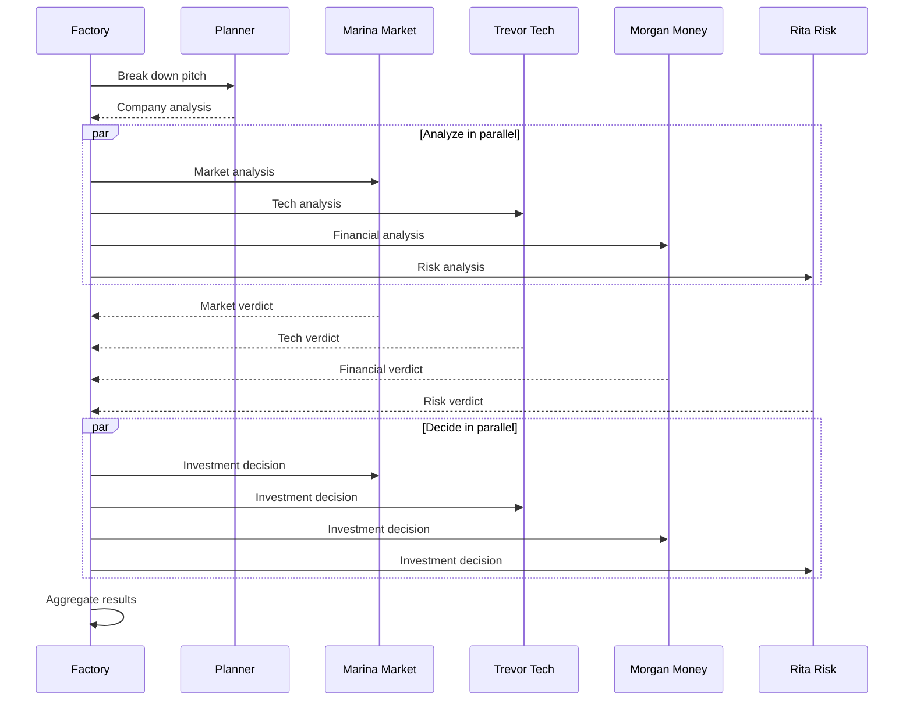
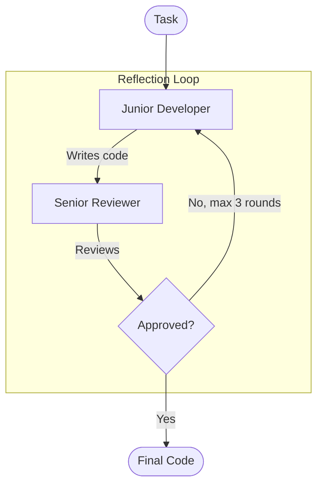
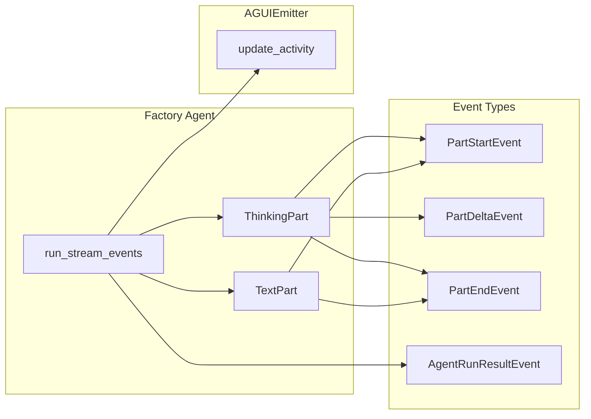
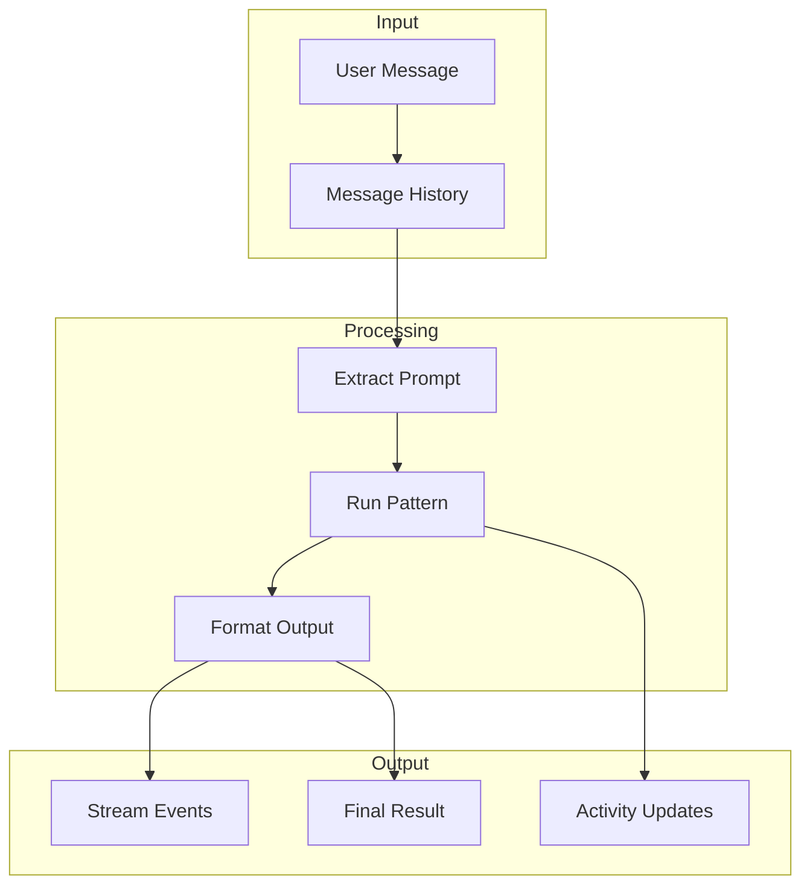
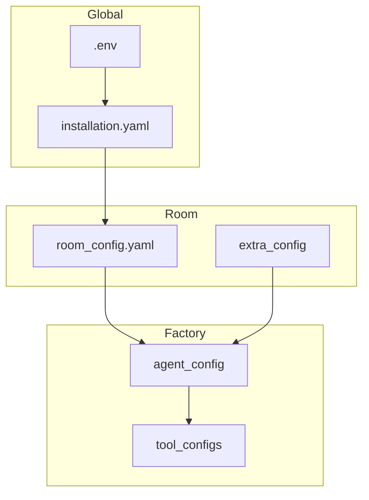

# Architecture Overview

Crazy Glue connects three systems: **Soliplex** (room framework), **agentic-design** (pattern implementations), and **AG-UI** (protocol for UI state updates).

## System Architecture

## Factory Agent Flow

Factory agents implement a streaming interface that produces events compatible with pydantic-ai:

## AG-UI Integration

AG-UI protocol enables rich UI updates during agent execution:

!!! warning "State Snapshot Timing"
    Due to a race condition in `multiplex_streams`, STATE_SNAPSHOT events may be rejected if RUN_FINISHED arrives first. **Use activities exclusively** for factory agents.

## Multi-Agent Patterns

### Debate Pattern (Parallelization)

### Shark Tank Pattern (Planning + Parallelization)

### Code Review Pattern (Reflection)

## Event Stream Architecture

## Data Flow

## Configuration Hierarchy

