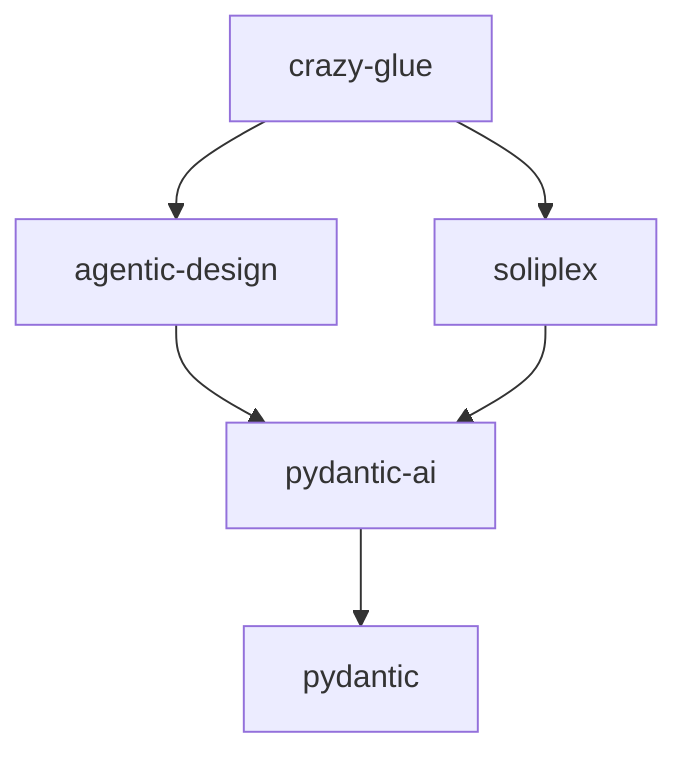

# Getting Started

## Prerequisites

- **Python 3.11+**
- **Ollama** running locally or on a remote server
- **Git** with submodule support

## Installation

### 1. Clone the repository

```bash
git clone --recursive https://github.com/runyaga/crazy-glue.git
cd crazy-glue
```

If you've already cloned without `--recursive`:

```bash
git submodule update --init --recursive
```

### 2. Set up Ollama

Install [Ollama](https://ollama.ai/) and pull the required model:

```bash
ollama pull gpt-oss:20b
```

Any Ollama model works. Configure the model in room configs via `extra_config`.

### 3. Configure environment

Create `.env` file:

```bash
OLLAMA_BASE_URL=http://localhost:11434
LOGFIRE_TOKEN=your_token_here  # Optional: for observability
```

### 4. Install packages

```bash
# Create virtual environment
python -m venv .venv
source .venv/bin/activate

# Install all packages in editable mode
pip install -e . -e ./agentic-design -e ./soliplex
```

## Running the Server

```bash
soliplex-cli serve . --no-auth-mode
```

### Connecting to the Server

**Option 1: Python TUI (recommended)**

```bash
soliplex-tui --url http://127.0.0.1:8000
```

**Option 2: Web browser**

Open `http://localhost:8000` in your browser. Select a room from the sidebar.

## Project Dependencies



| Package | Purpose |
|---------|---------|
| `crazy-glue` | Factory agents and room configs |
| `agentic-design` | Pattern implementations |
| `soliplex` | Room framework and AG-UI |
| `pydantic-ai` | Agent framework |

## Testing a Room

1. Start the server: `soliplex-cli serve . --no-auth-mode`
2. Connect via TUI: `soliplex-tui --url http://127.0.0.1:8000`
3. Select "Shark Tank" from the room list
4. Enter a startup pitch: "An app that connects dog owners for neighborhood playdates"
5. Watch the sharks analyze and decide

## Configuration Files

### installation.yaml

```yaml
room_paths:
  - ./rooms

agent_template_configs:
  - path: ./agentic-design/src/agentic_patterns
    module_prefix: agentic_patterns

environment_defaults:
  OLLAMA_BASE_URL: http://localhost:11434
```

### Room Configuration

Each room has a `room_config.yaml`:

```yaml
id: "shark-tank"
name: "Shark Tank"
description: "Pitch your startup to AI investors"

agent:
  kind: "factory"
  factory_name: "crazy_glue.factories.shark_tank_factory.create_shark_tank_agent"
  with_agent_config: true
  extra_config: {}

suggestions:
  - "An app that matches dog owners for playdates"
  - "AI-powered personal stylist"
```

See [Room Configuration](room-configuration.md) for full documentation.

## Development

### Run tests

```bash
pytest tests/
```

### Lint and format

```bash
ruff check src/
ruff format src/
```

### Build documentation

```bash
mkdocs serve  # Local preview at http://localhost:8001
mkdocs build  # Build static site
```

## Troubleshooting

### Connection refused to Ollama

Ensure Ollama is running:

```bash
ollama serve
```

Check the URL in `.env` matches your Ollama instance.

### Module not found errors

Ensure all packages are installed in editable mode:

```bash
pip install -e . -e ./agentic-design -e ./soliplex
```

### AG-UI state not updating

Factory agents should use **activities** instead of state snapshots due to timing race conditions. See [AG-UI Protocol](ag-ui.md) for details.
