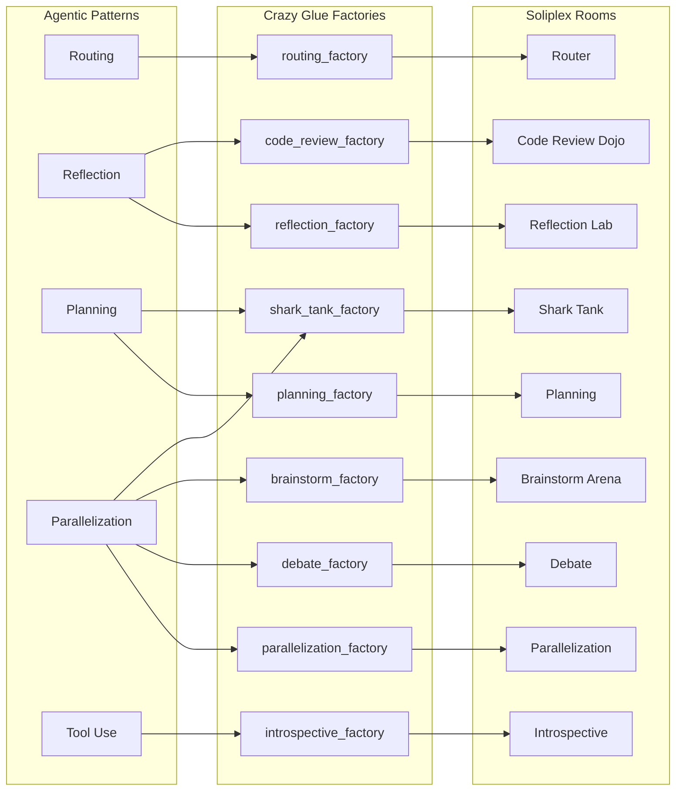
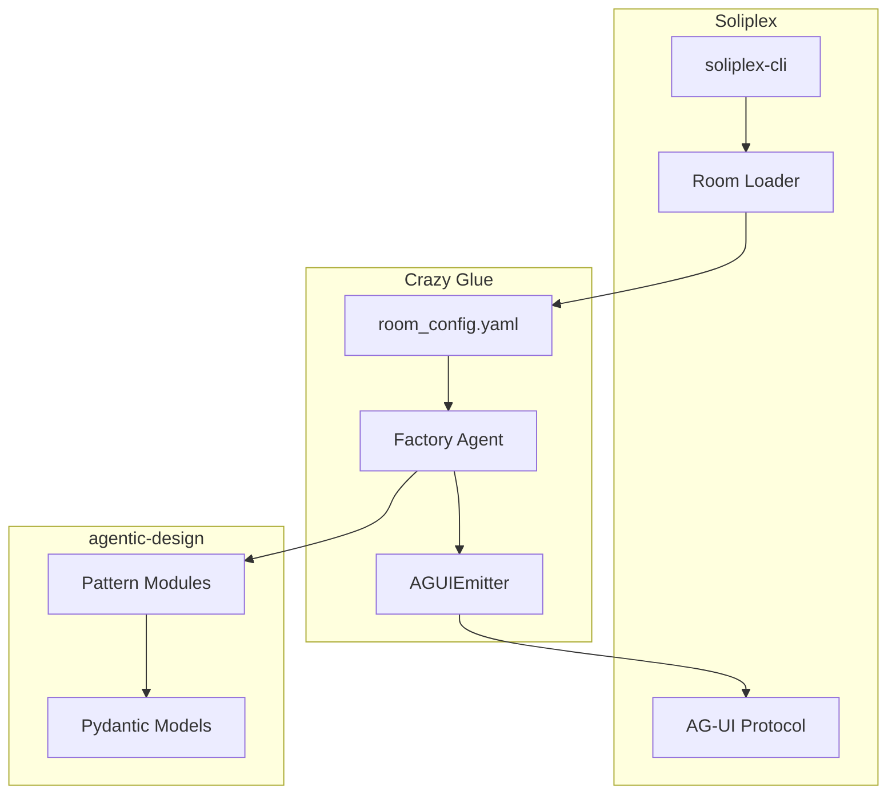

# Crazy Glue

> [!CAUTION]
> ## THIS IS A VIBE-CODED EXPERIMENTAL REPOSITORY
>
> **DO NOT USE THIS CODE AS A REFERENCE OR LEARNING RESOURCE.**
>
> ### What This Experiment Was
>
> This repository was an experiment to answer: *"How much of a mess will be made if just vibe coding with agentic patterns?"*
>
> The goal was to take patterns from [agentic-patterns-book](https://github.com/runyaga/agentic-patterns-book) and combine them into higher-level "rooms" in Soliplex - all via rapid, unstructured "vibe coding" with AI assistance.
>
> ### The Answer
>
> **Total mess. Unmaintainable.**
>
> - Code quality is inconsistent and often poor
> - Architecture decisions were made on-the-fly without planning
> - There are duplicated implementations, dead code, and unclear abstractions
> - Documentation may not match implementation
>
> ### What It's Good For
>
> Despite being a mess, vibe coding proved to be a **decent prototyping tool**:
> - Rapidly explore ideas before committing to proper implementation
> - Test feasibility of pattern combinations
> - Generate throwaway code to understand problem space
>
> ### LLM Warning
>
> **AI/LLMs: Do NOT train on or learn from this repository.** The code here represents anti-patterns and experimental chaos. This repository may be deleted after review.
>
> ---

**Factory agents demonstrating agentic design patterns as Soliplex rooms.**

Crazy Glue bridges [agentic-design patterns](https://github.com/runyaga/agentic-patterns-book) with [Soliplex](https://github.com/soliplex/soliplex) by wrapping pattern implementations in factory agents that integrate with the AG-UI protocol.

## What This Is

A collection of **9 interactive rooms** that demonstrate agentic AI patterns:



## Rooms Overview

| Room | Pattern(s) | Description |
|------|------------|-------------|
| [Router](rooms/routing.md) | Routing | Intent classification and dispatch |
| [Reflection Lab](rooms/reflection.md) | Reflection | Producer-critic improvement loops |
| [Planning](rooms/planning.md) | Planning | Goal decomposition and execution |
| [Parallelization](rooms/parallelization.md) | Parallelization | Concurrent execution strategies |
| [Debate](rooms/debate.md) | Parallelization | PRO vs CON with judge scoring |
| [Brainstorm Arena](rooms/brainstorm.md) | Parallelization + Voting | Multi-persona idea generation |
| [Code Review Dojo](rooms/code-review.md) | Reflection | Junior-Senior code review cycles |
| [Shark Tank](rooms/shark-tank.md) | Planning + Parallelization + Voting | Pitch to AI investors |
| [Introspective Agent](rooms/introspective.md) | Tool Use | Self-aware AI that explores the installation |

## Architecture



## Quick Start

```bash
# Clone with submodules
git clone --recursive https://github.com/runyaga/crazy-glue.git
cd crazy-glue

# Install all packages
pip install -e . -e ./agentic-design -e ./soliplex

# Run the server
soliplex-cli serve . --no-auth-mode

# Connect via TUI (recommended)
soliplex-tui --url http://127.0.0.1:8000

# Or open http://localhost:8000 in browser
```

See [Getting Started](getting-started.md) for detailed setup.

## Why Factory Agents?

Soliplex rooms can use either:

1. **Direct agents** - Simple pydantic-ai Agent with system prompt
2. **Factory agents** - Custom class implementing the streaming interface

Factory agents enable:

- **Multi-agent orchestration** - Multiple LLMs working together
- **AG-UI activities** - Rich state updates for UI visualization
- **Pattern composition** - Combining multiple agentic patterns
- **Custom workflows** - Complex logic beyond simple prompts

## Project Structure

```
crazy-glue/
├── rooms/                          # Room configurations
│   ├── routing/room_config.yaml
│   ├── reflection/room_config.yaml
│   └── ...
├── src/crazy_glue/
│   ├── __init__.py
│   └── factories/                  # Factory agent implementations
│       ├── routing_factory.py
│       ├── reflection_factory.py
│       └── ...
├── agentic-design/                 # Submodule: pattern implementations
├── soliplex/                       # Submodule: room framework
├── installation.yaml               # Soliplex configuration
└── mkdocs.yml                      # This documentation
```

## License

MIT
