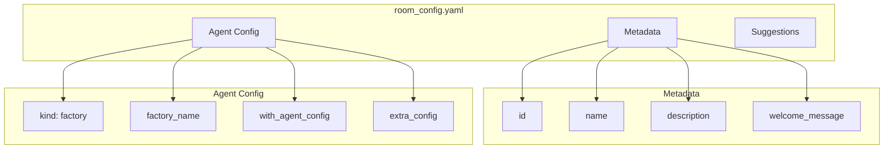

# Room Configuration

Each Soliplex room is defined by a `room_config.yaml` file that specifies metadata, agent configuration, and suggested prompts.

## Configuration Structure



## Complete Example

```yaml
id: "shark-tank"
name: "Shark Tank"
description: "Pitch your startup to 4 AI sharks who analyze and decide whether to invest"
welcome_message: |
  Welcome to the Shark Tank!

  Pitch your startup idea and face our panel of sharks:

  - **Marina Market** - The Market Maven (obsesses over TAM and timing)
  - **Trevor Tech** - The Tech Titan (evaluates technical defensibility)
  - **Morgan Money** - The Money Mogul (focuses on unit economics)
  - **Rita Risk** - The Risk Ranger (identifies threats and red flags)

  **How it works:**
  1. Your pitch is broken down into key areas
  2. All 4 sharks analyze simultaneously
  3. Each shark makes their investment decision
  4. Final verdict: Funded or No Deal!

suggestions:
  - "An app that matches dog owners for neighborhood playdates"
  - "AI-powered personal stylist that works with your existing wardrobe"
  - "Subscription service for locally-sourced office snacks"
  - "Platform connecting retirees with startups for mentorship"

agent:
  kind: "factory"
  factory_name: "crazy_glue.factories.shark_tank_factory.create_shark_tank_agent"
  with_agent_config: true
  extra_config:
    model_name: "gpt-oss:20b"
```

## Field Reference

### Metadata Fields

| Field | Type | Required | Description |
|-------|------|----------|-------------|
| `id` | string | Yes | Unique room identifier (URL slug) |
| `name` | string | Yes | Display name in UI |
| `description` | string | Yes | Short description for room list |
| `welcome_message` | string | No | Markdown message shown on room entry |
| `suggestions` | list | No | Example prompts shown as quick-start buttons |

### Agent Configuration

| Field | Type | Required | Description |
|-------|------|----------|-------------|
| `kind` | string | Yes | `"factory"` for factory agents, `"simple"` for basic agents |
| `factory_name` | string | Yes* | Full module path to factory function |
| `with_agent_config` | bool | No | Pass agent config to factory (default: false) |
| `extra_config` | dict | No | Custom configuration passed to factory |

*Required when `kind: "factory"`

## Factory Agent Pattern

### Factory Function Signature

```python
def create_my_agent(
    agent_config: config.FactoryAgentConfig,
    tool_configs: config.ToolConfigMap = None,
    mcp_client_toolset_configs: config.MCP_ClientToolsetConfigMap = None,
) -> MyAgent:
    """Factory function to create the agent."""
    return MyAgent(agent_config, tool_configs, mcp_client_toolset_configs)
```

### Agent Class Structure

```python
@dataclasses.dataclass
class MyAgent:
    """Agent implementing the streaming interface."""

    agent_config: config.FactoryAgentConfig
    tool_configs: config.ToolConfigMap = None
    mcp_client_toolset_configs: config.MCP_ClientToolsetConfigMap = None

    output_type = None  # Or a Pydantic model
    _model = None

    @property
    def model_name(self) -> str:
        return self.agent_config.extra_config.get("model_name", "gpt-oss:20b")

    def _get_model(self):
        """Create model using soliplex configuration."""
        if self._model is None:
            installation_config = self.agent_config._installation_config
            provider_base_url = installation_config.get_environment("OLLAMA_BASE_URL")
            provider = ollama_providers.OllamaProvider(
                base_url=f"{provider_base_url}/v1",
            )
            self._model = openai_models.OpenAIChatModel(
                model_name=self.model_name,
                provider=provider,
            )
        return self._model

    async def run_stream_events(
        self,
        output_type: typing.Any = None,
        message_history: MessageHistory | None = None,
        deferred_tool_results: typing.Any = None,
        deps: ai_tools.AgentDepsT = None,
        **kwargs: typing.Any,
    ) -> abc.AsyncIterator[NativeEvent]:
        """Stream events for the agent execution."""
        # Extract user prompt
        prompt = _extract_prompt(message_history)

        # Get AG-UI emitter from deps
        emitter = getattr(deps, "agui_emitter", None) if deps else None

        # ... implementation ...

        yield ai_run.AgentRunResultEvent(result=response)
```

## Configuration Patterns

### Minimal Factory Room

```yaml
id: "simple-router"
name: "Simple Router"
description: "Route queries to handlers"

agent:
  kind: "factory"
  factory_name: "crazy_glue.factories.routing_factory.create_routing_agent"
  with_agent_config: true
```

### Room with Custom Model

```yaml
id: "fast-debate"
name: "Fast Debate"
description: "Quick debates using smaller model"

agent:
  kind: "factory"
  factory_name: "crazy_glue.factories.debate_factory.create_debate_agent"
  with_agent_config: true
  extra_config:
    model_name: "llama3:8b"
    num_rounds: 2
```

### Room with Multiple Config Options

```yaml
id: "code-review"
name: "Code Review Dojo"
description: "Junior-senior code review cycles"

agent:
  kind: "factory"
  factory_name: "crazy_glue.factories.code_review_factory.create_code_review_agent"
  with_agent_config: true
  extra_config:
    model_name: "gpt-oss:20b"
    max_rounds: 3
    language: "python"
```

## Accessing Configuration in Factory

```python
@property
def num_rounds(self) -> int:
    """Get number of rounds from config, with default."""
    return self.agent_config.extra_config.get("num_rounds", 2)

@property
def model_name(self) -> str:
    """Get model name from config, with default."""
    return self.agent_config.extra_config.get("model_name", "gpt-oss:20b")
```

## Environment Variables

Environment variables are accessed via the installation config:

```python
installation_config = self.agent_config._installation_config
ollama_url = installation_config.get_environment("OLLAMA_BASE_URL")
```

Define defaults in `installation.yaml`:

```yaml
environment_defaults:
  OLLAMA_BASE_URL: http://localhost:11434
  DEFAULT_MODEL: gpt-oss:20b
```

Override in `.env`:

```
OLLAMA_BASE_URL=http://remote-server:11434
```

## Directory Structure

```
rooms/
├── routing/
│   └── room_config.yaml
├── reflection/
│   └── room_config.yaml
├── planning/
│   └── room_config.yaml
├── parallelization/
│   └── room_config.yaml
├── debate/
│   └── room_config.yaml
├── brainstorm/
│   └── room_config.yaml
├── code-review/
│   └── room_config.yaml
└── shark-tank/
    └── room_config.yaml
```

Each room folder contains only `room_config.yaml`. Factory implementations live in `src/crazy_glue/factories/`.
