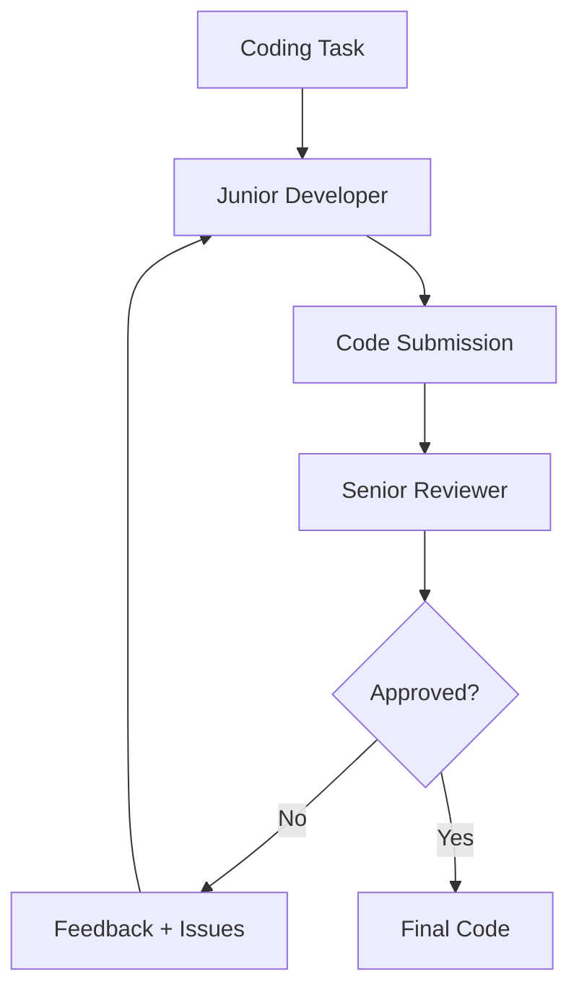
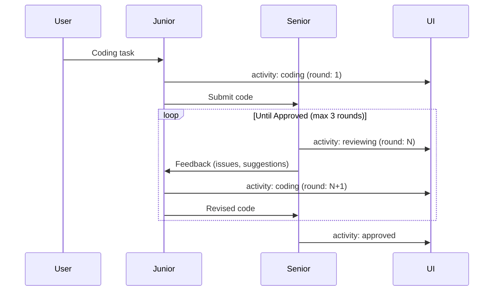

# Code Review Dojo Room

**Pattern**: Reflection
**Purpose**: Junior-senior code review cycles until approval

## How It Works



## The Review Cycle



## Example Session

**Task**: "Write a function to check if a string is a palindrome"

**Round 1**:
```python
def is_palindrome(s):
    return s == s[::-1]
```

**Review**: Not approved
- Issues: Doesn't handle case sensitivity, ignores spaces/punctuation
- Suggestions: Normalize input before comparison

**Round 2**:
```python
def is_palindrome(s):
    cleaned = ''.join(c.lower() for c in s if c.isalnum())
    return cleaned == cleaned[::-1]
```

**Review**: Approved
- Praise: Clean implementation, handles edge cases
- No issues

## AG-UI Activities

The Code Review room provides rich activity data including full code and review details:

```python
emitter.update_activity("code_review", {
    "status": "coding",
    "task": "Write a palindrome checker",
    "round": 1,
}, activity_id)

emitter.update_activity("code_review", {
    "status": "reviewed",
    "task": task,
    "round": 1,
    "code": "def is_palindrome(s):\n    return s == s[::-1]",
    "explanation": "Simple slice reversal comparison",
    "review": {
        "approved": False,
        "issues": ["Doesn't handle case sensitivity", "Ignores punctuation"],
        "suggestions": ["Normalize input before comparison"],
        "praise": ["Concise approach"],
    },
}, activity_id)

emitter.update_activity("code_review", {
    "status": "approved",
    "task": task,
    "round": 2,
    "code": "def is_palindrome(s):\n    cleaned = ''.join(...)\n    ...",
    "total_rounds": 2,
}, activity_id)
```

## Configuration

```yaml
id: "code-review"
name: "Code Review Dojo"
description: "Junior writes code, senior reviews until approved"

agent:
  kind: "factory"
  factory_name: "crazy_glue.factories.code_review_factory.create_code_review_agent"
  with_agent_config: true
  extra_config:
    model_name: "gpt-oss:20b"
    max_rounds: 3
    language: "python"

suggestions:
  - "Write a function to check if a string is a palindrome"
  - "Implement a simple LRU cache"
  - "Create a function to find the nth Fibonacci number"
  - "Write a binary search function"
```

## Pydantic Models

```python
class CodeSubmission(pydantic.BaseModel):
    """Junior's code submission."""
    code: str = pydantic.Field(description="The implementation code")
    explanation: str = pydantic.Field(description="Brief explanation of approach")


class CodeReview(pydantic.BaseModel):
    """Senior's review."""
    approved: bool = pydantic.Field(description="Whether code is approved")
    issues: list[str] = pydantic.Field(description="Problems found")
    suggestions: list[str] = pydantic.Field(description="Improvement suggestions")
    praise: list[str] = pydantic.Field(description="What was done well")
```

## Factory Implementation

```python
@dataclasses.dataclass
class CodeReviewAgent:
    @property
    def max_rounds(self) -> int:
        return self.agent_config.extra_config.get("max_rounds", 3)

    async def run_stream_events(self, ...):
        task = _extract_prompt(message_history)

        junior = Agent(model, output_type=CodeSubmission, retries=3)
        senior = Agent(model, output_type=CodeReview, retries=3)

        feedback = ""
        for round_num in range(1, self.max_rounds + 1):
            # Junior writes code
            prompt = f"Task: {task}\n{feedback}"
            submission = await junior.run(prompt)

            # Senior reviews
            review = await senior.run(f"Review:\n{submission.code}")

            if review.output.approved:
                break

            feedback = f"Issues: {review.output.issues}\nSuggestions: {review.output.suggestions}"

        yield ai_run.AgentRunResultEvent(result=final_code)
```

## Use Cases

- **Code generation**: Quality-assured code output
- **Learning**: Understand code review feedback
- **Refactoring**: Iterative improvement suggestions
- **Best practices**: Learn from senior feedback

## Related Patterns

- **Reflection Lab**: General producer-critic pattern
- **Planning**: For complex multi-file implementations
