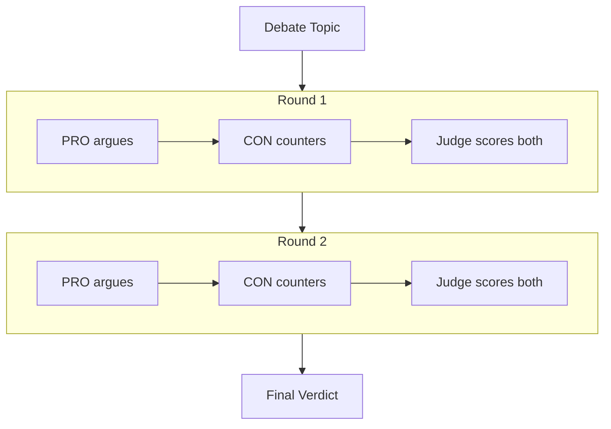
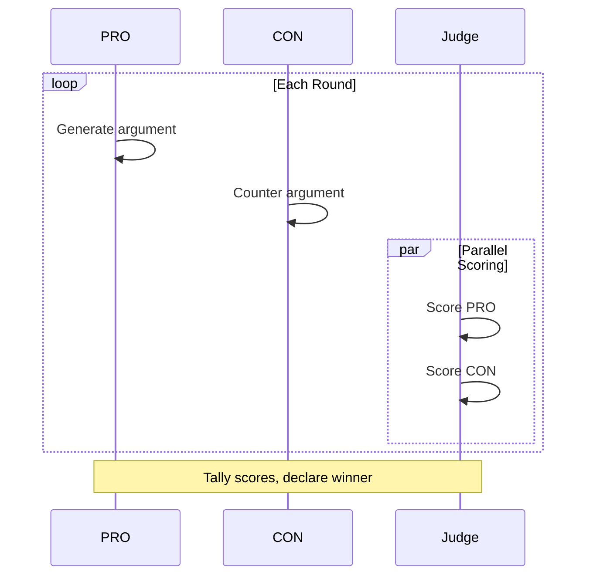

# Debate Room

**Pattern**: Parallelization (Multi-Agent)
**Purpose**: PRO vs CON debate with parallel judge scoring

## How It Works



## Debate Flow



## Example Session

**Topic**: "Should AI be regulated?"

**Round 1**:
- PRO: "AI regulation is essential to prevent harm. Unchecked AI development risks job displacement, privacy violations, and potential misuse in surveillance."
- CON: "Regulation stifles innovation. The AI field moves too fast for bureaucrats to keep up, and heavy-handed rules will push development offshore."
- Scores: PRO 7.5, CON 6.0

**Round 2**:
- PRO: "Look at GDPR's success in protecting privacy without killing tech. Smart regulation creates trust that accelerates adoption."
- CON: "GDPR cost European companies billions in compliance. Meanwhile, US and China AI companies surged ahead. Regulation = competitive disadvantage."
- Scores: PRO 8.0, CON 7.5

**Final**: PRO wins (15.5 vs 13.5)

## AG-UI Activities

Activity updates show real-time debate progress:

```python
emitter.update_activity("debate", {
    "status": "pro_speaking",
    "round": 1,
    "pro_score": 0,
    "con_score": 0,
}, activity_id)

emitter.update_activity("debate", {
    "status": "judging",
    "round": 1,
    "pro_score": 7.5,
    "con_score": 6.0,
}, activity_id)

emitter.update_activity("debate", {
    "status": "complete",
    "winner": "PRO",
    "topic": "Should AI be regulated?",
    "total_rounds": 2,
    "pro_score": 15.5,
    "con_score": 13.5,
}, activity_id)
```

## Configuration

```yaml
id: "debate"
name: "Debate"
description: "PRO vs CON debate with judge scoring"

agent:
  kind: "factory"
  factory_name: "crazy_glue.factories.debate_factory.create_debate_agent"
  with_agent_config: true
  extra_config:
    model_name: "gpt-oss:20b"
    num_rounds: 2

suggestions:
  - "Should AI be regulated?"
  - "Is remote work better than office work?"
  - "Should social media require age verification?"
  - "Is college education worth the cost?"
```

## Parallel Judge Scoring

The debate room demonstrates `asyncio.gather` for parallel execution:

```python
# Score both arguments in parallel
pro_score_task = judge_agent.run(f"Score this PRO argument: {pro_arg}")
con_score_task = judge_agent.run(f"Score this CON argument: {con_arg}")
pro_score_res, con_score_res = await asyncio.gather(pro_score_task, con_score_task)
```

This reduces latency by scoring both arguments simultaneously instead of sequentially.

## Factory Implementation

```python
@dataclasses.dataclass
class DebateAgent:
    @property
    def num_rounds(self) -> int:
        return self.agent_config.extra_config.get("num_rounds", 2)

    async def run_stream_events(self, ...):
        topic = _extract_prompt(message_history)

        pro_agent = Agent(model, system_prompt=PRO_SYSTEM_PROMPT, retries=3)
        con_agent = Agent(model, system_prompt=CON_SYSTEM_PROMPT, retries=3)
        judge_agent = Agent(model, output_type=JudgeScore, retries=3)

        pro_total, con_total = 0.0, 0.0

        for round_num in range(1, self.num_rounds + 1):
            # PRO argues
            pro_result = await pro_agent.run(topic)

            # CON counters
            con_result = await con_agent.run(f"{topic}\nOpponent: {pro_result}")

            # Judge scores in parallel
            pro_task = judge_agent.run(f"Score PRO: {pro_result}")
            con_task = judge_agent.run(f"Score CON: {con_result}")
            pro_score, con_score = await asyncio.gather(pro_task, con_task)

            pro_total += pro_score.output.score
            con_total += con_score.output.score

        winner = "PRO" if pro_total > con_total else "CON"
```

## Use Cases

- **Decision making**: Explore both sides of a decision
- **Education**: Understand arguments for/against topics
- **Content creation**: Generate balanced perspectives
- **Critical thinking**: Challenge assumptions

## Related Patterns

- **Brainstorm Arena**: Multiple perspectives with voting
- **Shark Tank**: Multi-perspective analysis with decisions
