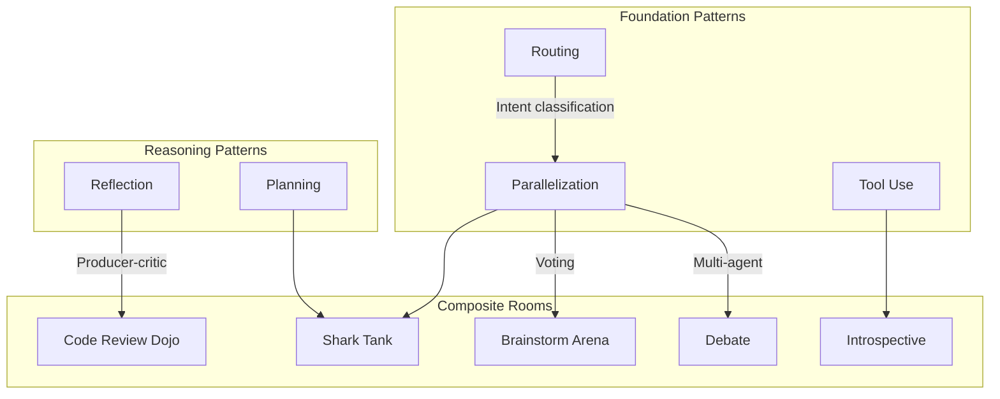
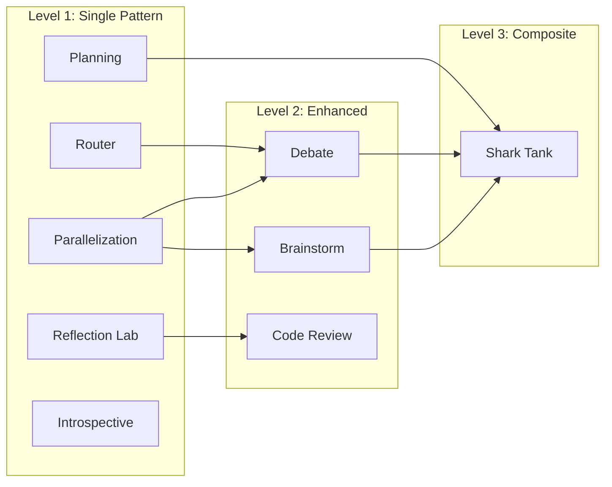

# Rooms Overview

Crazy Glue provides 9 interactive rooms demonstrating agentic design patterns.

## Room Catalog



## Pattern Matrix

| Room | Routing | Reflection | Planning | Parallelization | Tool Use | Voting |
|------|:-------:|:----------:|:--------:|:---------------:|:--------:|:------:|
| [Router](routing.md) | X | | | | | |
| [Reflection Lab](reflection.md) | | X | | | | |
| [Planning](planning.md) | | | X | | | |
| [Parallelization](parallelization.md) | | | | X | | |
| [Debate](debate.md) | | | | X | | |
| [Brainstorm Arena](brainstorm.md) | | | | X | | X |
| [Code Review Dojo](code-review.md) | | X | | | | |
| [Shark Tank](shark-tank.md) | | | X | X | | X |
| [Introspective Agent](introspective.md) | | | | | X | |

## Quick Reference

### Router
**Pattern**: Routing
**Purpose**: Classify user intent and dispatch to appropriate handler
**Best for**: Understanding how routing patterns work

### Reflection Lab
**Pattern**: Reflection
**Purpose**: Generate content with producer-critic improvement loops
**Best for**: Content generation requiring quality iteration

### Planning
**Pattern**: Planning
**Purpose**: Decompose goals into steps and execute
**Best for**: Complex tasks requiring structured breakdown

### Parallelization
**Pattern**: Parallelization
**Purpose**: Execute tasks concurrently (sectioning, voting, map-reduce)
**Best for**: Understanding parallel execution strategies

### Debate
**Pattern**: Parallelization (multi-agent)
**Purpose**: PRO vs CON debate with judge scoring
**Best for**: Exploring multiple perspectives on a topic

### Brainstorm Arena
**Pattern**: Parallelization + Voting
**Purpose**: Multi-persona idea generation with consensus voting
**Best for**: Creative ideation and brainstorming

### Code Review Dojo
**Pattern**: Reflection
**Purpose**: Junior writes code, senior reviews, iterate until approved
**Best for**: Understanding code review workflows

### Shark Tank
**Pattern**: Planning + Parallelization + Voting
**Purpose**: Pitch startup to AI investors who analyze and decide
**Best for**: Comprehensive multi-pattern demonstration

### Introspective Agent
**Pattern**: Tool Use
**Purpose**: Self-aware AI that explores and explains the installation
**Best for**: Learning how soliplex works, debugging configuration

## Complexity Progression

Start simple and progress to more complex rooms:



## Running Rooms

1. Start the server:
   ```bash
   soliplex-cli serve . --no-auth-mode
   ```

2. Connect via TUI (recommended):
   ```bash
   soliplex-tui --url http://127.0.0.1:8000
   ```
   Or open `http://localhost:8000` in browser

3. Select a room from the sidebar

4. Enter a prompt or click a suggestion

5. Watch the agent work with real-time AG-UI updates
