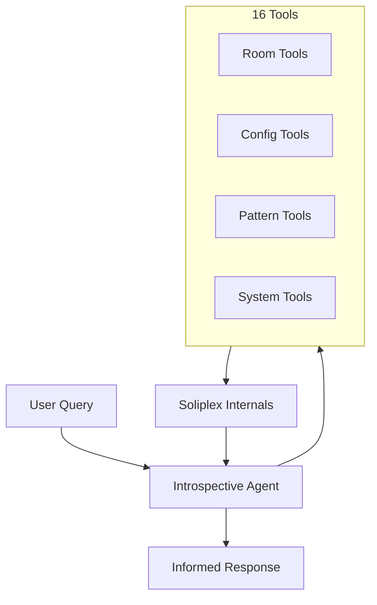
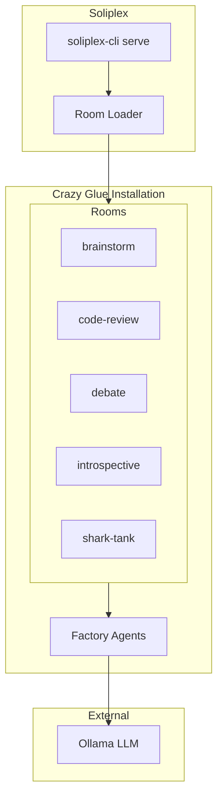
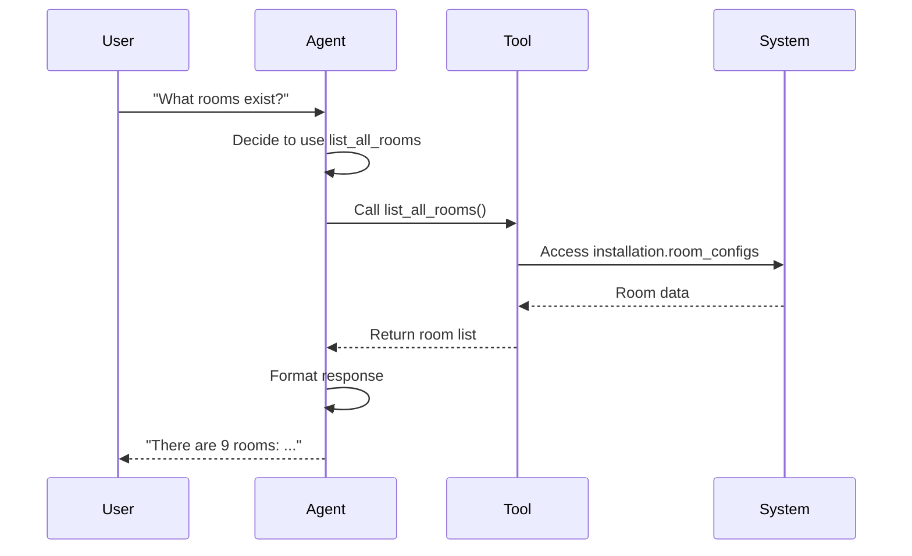

# Introspective Agent Room

**Pattern**: Tool Use
**Purpose**: A self-aware AI that explores and explains the soliplex installation

## Overview

The Introspective Agent is a unique room that demonstrates the **Tool Use** pattern. Unlike other rooms that process user content, this agent uses tools to inspect the **live soliplex installation** it's running in.



## What Makes It Special

This room is **self-aware**:
- It can inspect its own configuration
- It can list and examine other rooms
- It can explain why it exists
- It knows what tools it has

```mermaid
flowchart LR
    subgraph Self-Awareness
        WhoAmI[who_am_i]
        MyTools[list_my_tools]
    end

    subgraph System Knowledge
        Rooms[list_all_rooms]
        Config[get_installation_info]
        Health[run_health_check]
    end

    Agent[Introspective<br/>Agent] --> Self-Awareness
    Agent --> System Knowledge
```

## Available Tools

### Room Inspection Tools

| Tool | Purpose |
|------|---------|
| `list_all_rooms` | List all rooms with id, name, description |
| `inspect_room` | Get full configuration for a specific room |
| `get_room_suggestions` | Get example prompts for a room |

### Configuration Tools

| Tool | Purpose |
|------|---------|
| `get_installation_info` | Show installation ID, paths, room count |
| `get_environment_variables` | Display configured environment variables |
| `get_secrets_info` | List secret names (not values) |

### Factory Agent Tools

| Tool | Purpose |
|------|---------|
| `list_factory_agents` | List all factory agents and which rooms use them |
| `inspect_factory` | Get docstrings, signatures for a factory |

### Pattern Tools

| Tool | Purpose |
|------|---------|
| `list_patterns` | List all known agentic patterns |
| `explain_pattern` | Detailed explanation with diagram |
| `find_rooms_by_pattern` | Find rooms using a specific pattern |

### Diagram Tools

| Tool | Purpose |
|------|---------|
| `generate_installation_diagram` | Mermaid diagram of full architecture |
| `generate_room_diagram` | Data flow diagram for specific room |

### System Tools

| Tool | Purpose |
|------|---------|
| `run_health_check` | Check rooms, ollama, config status |
| `who_am_i` | Information about this agent itself |
| `list_my_tools` | Meta: list all available tools |

## Example Sessions

### "What rooms are available?"

The agent calls `list_all_rooms()` to get real-time data:

```json
[
  {"id": "brainstorm", "name": "Brainstorm Arena", ...},
  {"id": "code-review", "name": "Code Review Dojo", ...},
  {"id": "debate", "name": "Debate", ...},
  {"id": "introspective", "name": "Introspective Agent", ...},
  {"id": "shark-tank", "name": "Shark Tank", ...}
]
```

### "Tell me about yourself"

The agent calls `who_am_i()`:

```json
{
  "i_am": "The Introspective Agent",
  "my_purpose": "I can explore and explain the soliplex installation",
  "my_factory": "crazy_glue.factories.introspective_factory.create_introspective_agent",
  "pattern_i_use": "tool_use",
  "my_capabilities": [
    "List and inspect rooms",
    "Show configuration and environment",
    "Explain agentic patterns",
    "Generate architecture diagrams",
    "Run health checks"
  ]
}
```

### "Generate an architecture diagram"

The agent calls `generate_installation_diagram()`:



## Configuration

```yaml
id: "introspective"
name: "Introspective Agent"
description: "A self-aware AI that explores and explains the soliplex installation"

agent:
  kind: "factory"
  factory_name: "crazy_glue.factories.introspective_factory.create_introspective_agent"
  with_agent_config: true
  extra_config:
    model_name: "gpt-oss:20b"

suggestions:
  - "What rooms are available in this installation?"
  - "Tell me about yourself - who are you?"
  - "Explain the parallelization pattern"
  - "Generate an architecture diagram"
```

## How Tools Work

The agent uses pydantic-ai's `@agent.tool` decorator to register tools:

```python
@agent.tool
def list_all_rooms(
    ctx: ai_tools.RunContext[IntrospectiveContext],
) -> list[dict[str, typing.Any]]:
    """List ALL rooms in the current soliplex installation."""
    installation = ctx.deps.installation_config
    rooms = []

    for room_id, room_config in installation.room_configs.items():
        rooms.append({
            "id": room_id,
            "name": room_config.name,
            "description": room_config.description,
            # ... more fields
        })

    return sorted(rooms, key=lambda r: r["id"])
```

The context (`ctx.deps`) provides access to the **live** `InstallationConfig` object, giving tools real-time access to:
- `installation.room_configs` - All loaded room configurations
- `installation.get_environment()` - Environment variables
- `installation.secrets` - Configured secrets
- `installation._config_path` - Installation file path

## Tool Use Pattern

This room demonstrates the Tool Use agentic pattern:



Key aspects:
- Agent decides **which tools** to use based on the query
- Tools access **real system data**, not mocked responses
- Agent synthesizes tool results into natural language

## Use Cases

- **Learning**: Understand how soliplex rooms work
- **Debugging**: Check configuration and environment
- **Documentation**: Generate live architecture diagrams
- **Exploration**: Discover available patterns and rooms

## Related Patterns

- **Routing**: Could route to introspective for meta-questions
- **Planning**: Could plan multi-step system analysis
