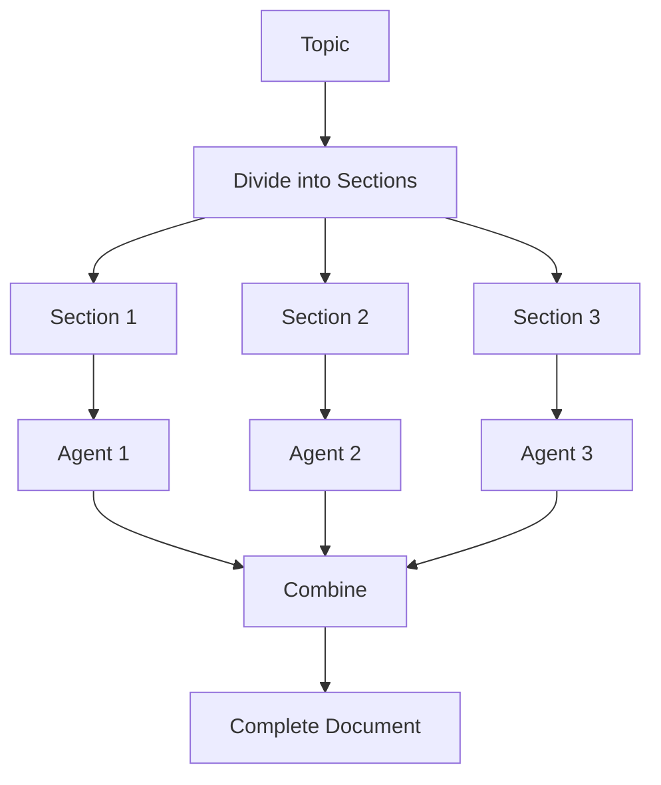
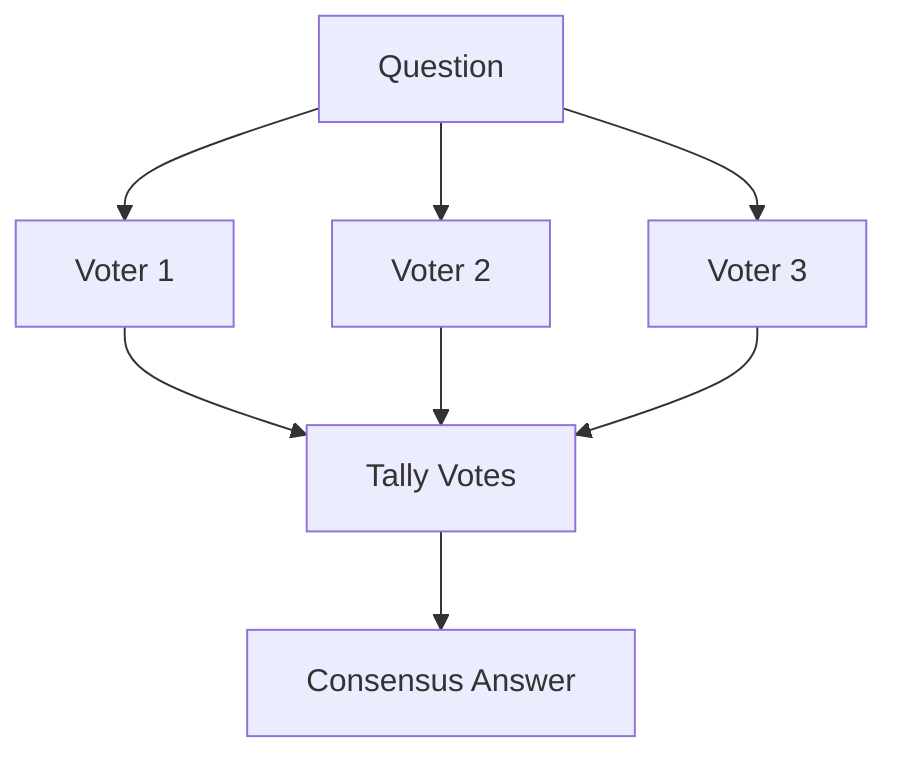
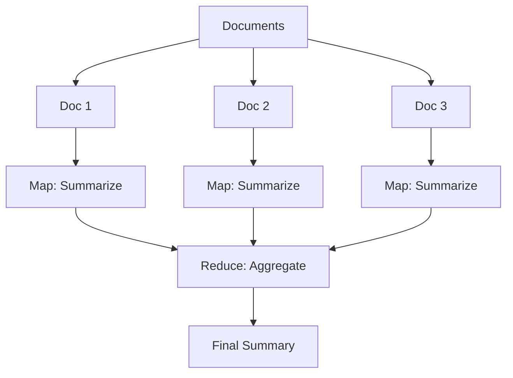
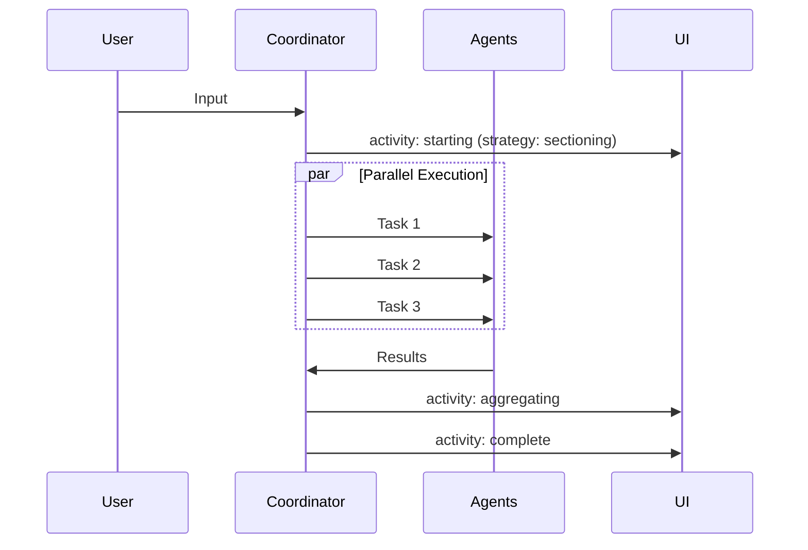

# Parallelization Room

**Pattern**: Parallelization
**Purpose**: Execute tasks concurrently using sectioning, voting, or map-reduce

## How It Works

### Sectioning


### Voting


### Map-Reduce


## Strategies

| Strategy | Use Case | Input Format |
|----------|----------|--------------|
| **Sectioning** | Divide and conquer | Topic with sections |
| **Voting** | Consensus decisions | Question |
| **Map-Reduce** | Batch processing | Multiple documents |

## Example Sessions

### Sectioning
**Input**: "Write about renewable energy: Solar, Wind, Hydro"

**Output**: Three parallel agents each write their section, combined into one document.

### Voting
**Input**: "Is Python or JavaScript better for web scraping?"

**Output**: 3 agents vote, majority wins with reasoning.

### Map-Reduce
**Input**: "Summarize these articles: [article1], [article2], [article3]"

**Output**: Each article summarized in parallel, then aggregated.

## AG-UI Activities



Activity data:

- `status`: Current phase
- `strategy`: sectioning, voting, or map_reduce
- `total_tasks`: Number of parallel tasks
- `completed_tasks`: Tasks finished
- `results`: Individual task results

## Configuration

```yaml
id: "parallelization"
name: "Parallelization"
description: "Concurrent execution with sectioning, voting, or map-reduce"

agent:
  kind: "factory"
  factory_name: "crazy_glue.factories.parallelization_factory.create_parallelization_agent"
  with_agent_config: true
  extra_config:
    model_name: "gpt-oss:20b"
    default_strategy: "sectioning"
    num_voters: 3

suggestions:
  - "Write about AI ethics: Privacy, Bias, Transparency"
  - "Is remote work better than office work?"
  - "Summarize: Article1 | Article2 | Article3"
```

## Factory Implementation

```python
@dataclasses.dataclass
class ParallelizationAgent:
    async def run_stream_events(self, ...):
        prompt = _extract_prompt(message_history)
        strategy = self._detect_strategy(prompt)

        if strategy == "sectioning":
            result = await self._run_sectioning(prompt)
        elif strategy == "voting":
            result = await self._run_voting(prompt)
        else:
            result = await self._run_map_reduce(prompt)

        yield ai_run.AgentRunResultEvent(result=result)

    async def _run_sectioning(self, prompt):
        sections = self._parse_sections(prompt)
        # Run all sections in parallel
        tasks = [agent.run(section) for section in sections]
        results = await asyncio.gather(*tasks)
        return self._combine_sections(results)
```

## Use Cases

- **Content generation**: Multi-section documents
- **Fact checking**: Multiple verification sources
- **Data analysis**: Batch processing
- **Brainstorming**: Parallel idea generation

## Related Patterns

- **Debate**: Specialized parallelization for arguments
- **Brainstorm Arena**: Parallelization with voting
- **Shark Tank**: Complex multi-pattern parallelization
