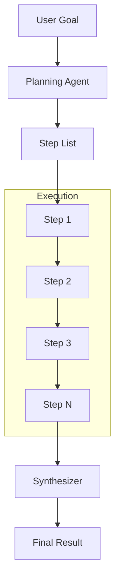
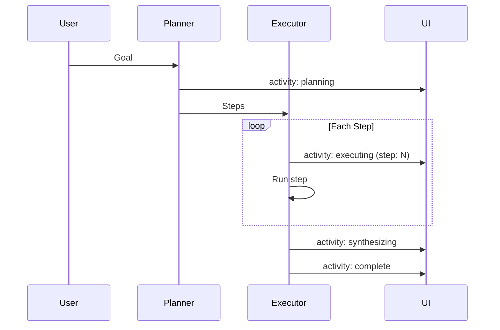

# Planning Room

**Pattern**: Planning
**Purpose**: Decompose goals into steps and execute

## How It Works



The planning pattern:

1. **Planner** decomposes goal into actionable steps
2. **Executor** runs each step sequentially
3. **Synthesizer** combines results into final output
4. Optional: Replan if steps fail

## Example Session

**Input**: "Research the top 3 AI startups in healthcare"

**Plan**:
1. Search for recent AI healthcare funding news
2. Identify top funded companies
3. Research each company's focus area
4. Compile comparison summary

**Execution**:
- Step 1: Found 5 recent funding rounds...
- Step 2: Top 3: Tempus ($1.1B), PathAI ($325M), Viz.ai ($100M)
- Step 3: Gathered details on each...
- Step 4: Synthesized comparison table

**Result**: Formatted comparison of top 3 AI healthcare startups

## AG-UI Activities



Activity data:

- `status`: Current phase (planning, executing, synthesizing, complete)
- `total_steps`: Number of steps planned
- `current_step`: Step being executed
- `step_results`: Results from completed steps
- `plan`: The generated plan

## Configuration

```yaml
id: "planning"
name: "Planning"
description: "Goal decomposition and step-by-step execution"

agent:
  kind: "factory"
  factory_name: "crazy_glue.factories.planning_factory.create_planning_agent"
  with_agent_config: true
  extra_config:
    model_name: "gpt-oss:20b"
    max_steps: 5
    allow_replan: true

suggestions:
  - "Research the top 3 AI startups in healthcare"
  - "Plan a 3-course dinner menu for a vegan guest"
  - "Create a study guide for learning Python"
  - "Outline a marketing strategy for a new mobile app"
```

## Factory Implementation

```python
@dataclasses.dataclass
class PlanningAgent:
    @property
    def max_steps(self) -> int:
        return self.agent_config.extra_config.get("max_steps", 5)

    async def run_stream_events(self, ...):
        goal = _extract_prompt(message_history)

        # Create plan
        plan = await planner_agent.run(goal)
        steps = plan.steps[:self.max_steps]

        # Execute steps
        results = []
        for i, step in enumerate(steps):
            result = await executor_agent.run(step)
            results.append(result)

        # Synthesize
        final = await synthesizer_agent.run(goal, results)

        yield ai_run.AgentRunResultEvent(result=final)
```

## Use Cases

- **Research tasks**: Multi-step information gathering
- **Project planning**: Break down complex projects
- **Content creation**: Structured document generation
- **Analysis**: Step-by-step data analysis

## Related Patterns

- **Routing**: For simpler, single-step tasks
- **Parallelization**: When steps can run concurrently
- **Shark Tank**: Combines planning with parallel analysis
