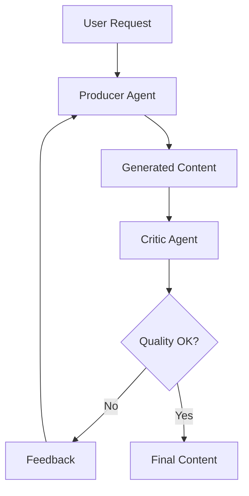
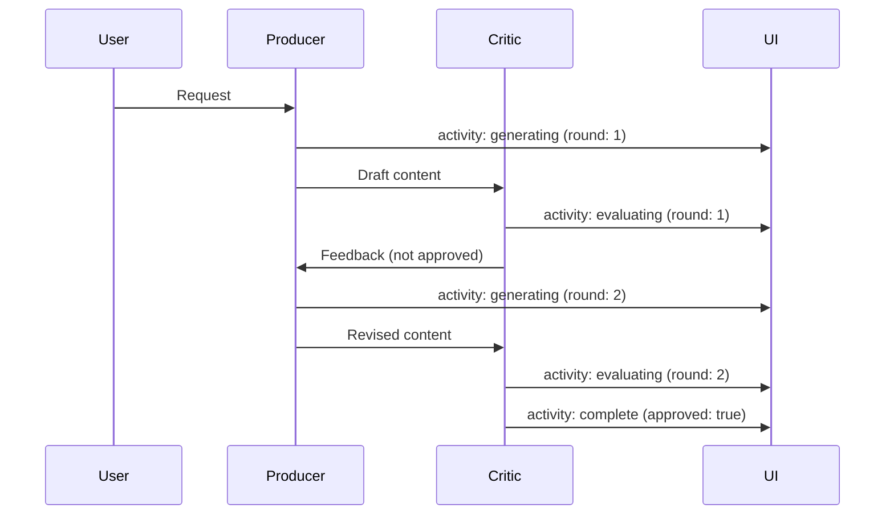

# Reflection Lab Room

**Pattern**: Reflection
**Purpose**: Generate content with producer-critic improvement loops

## How It Works



The reflection pattern:

1. **Producer** generates initial content
2. **Critic** evaluates against quality criteria
3. If not approved, feedback goes back to producer
4. Iterate until quality threshold met or max rounds reached

## Example Session

**Input**: "Write a tweet about the benefits of remote work"

**Round 1**:
- Producer: "Remote work is great! You can work from anywhere!"
- Critic: Not engaging enough. Needs specific benefits and a hook.

**Round 2**:
- Producer: "3 years of remote work taught me: 1) Commute time → family time 2) Flexible hours → peak productivity 3) Home office → zero distractions. The future of work isn't coming. It's here."
- Critic: Approved. Specific, engaging, good structure.

## AG-UI Activities



Activity data:

- `status`: Current phase
- `round`: Iteration number
- `content`: Current draft
- `feedback`: Critic's feedback
- `approved`: Final approval status

## Configuration

```yaml
id: "reflection"
name: "Reflection Lab"
description: "Content generation with critic feedback loops"

agent:
  kind: "factory"
  factory_name: "crazy_glue.factories.reflection_factory.create_reflection_agent"
  with_agent_config: true
  extra_config:
    model_name: "gpt-oss:20b"
    max_rounds: 3

suggestions:
  - "Write a tweet about the benefits of remote work"
  - "Create a product description for noise-canceling headphones"
  - "Draft a company mission statement for a sustainable fashion brand"
```

## Factory Implementation

```python
@dataclasses.dataclass
class ReflectionAgent:
    @property
    def max_rounds(self) -> int:
        return self.agent_config.extra_config.get("max_rounds", 3)

    async def run_stream_events(self, ...):
        prompt = _extract_prompt(message_history)

        for round_num in range(1, self.max_rounds + 1):
            # Generate
            content = await producer_agent.run(prompt_with_feedback)

            # Evaluate
            evaluation = await critic_agent.run(content)

            if evaluation.approved:
                break

            feedback = evaluation.feedback

        yield ai_run.AgentRunResultEvent(result=final_content)
```

## Use Cases

- **Content writing**: Blog posts, marketing copy, social media
- **Code generation**: Write and review until tests pass
- **Data extraction**: Validate schema compliance
- **Document creation**: Reports, proposals, documentation

## Related Patterns

- **Code Review Dojo**: Specialized reflection for code
- **Planning**: For content requiring research first
