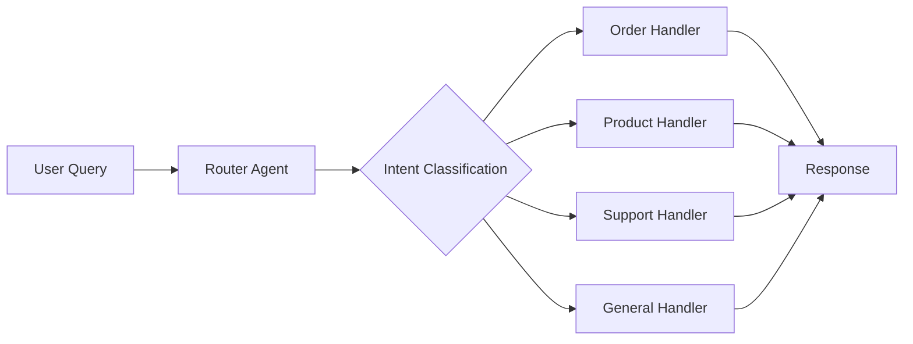
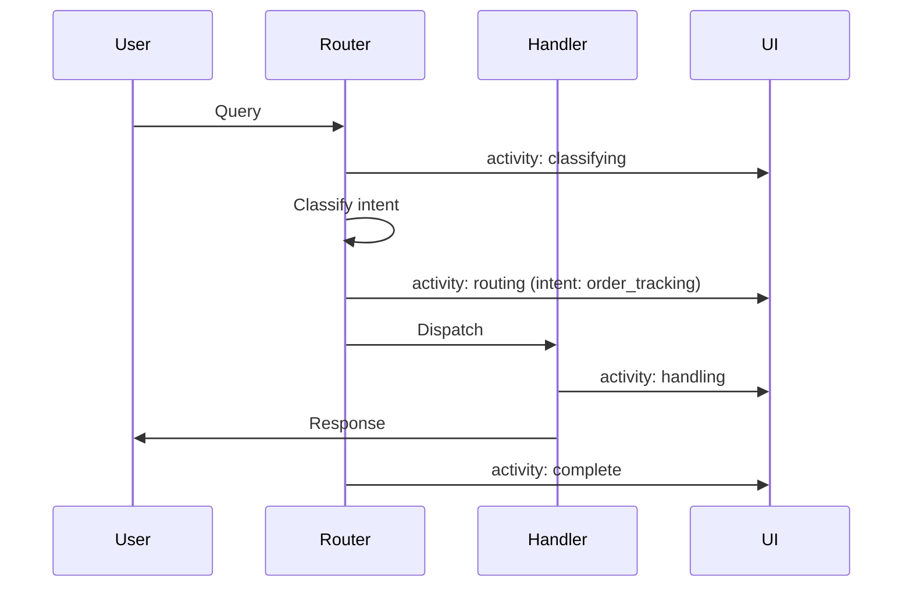

# Router Room

**Pattern**: Routing
**Purpose**: Classify user intent and dispatch to appropriate handler

## How It Works



The router agent:

1. Receives user query
2. Classifies intent with confidence score
3. Routes to appropriate handler
4. Returns handler response with classification metadata

## Example Session

**Input**: "Where is my order #12345?"

**Output**:
```
Intent Classification:
- Intent: order_tracking
- Confidence: 0.95

Handler Response:
I'll help you track order #12345. Let me look that up...
```

## AG-UI Activities



Activity data includes:

- `status`: Current phase (classifying, routing, handling, complete)
- `intent`: Classified intent type
- `confidence`: Classification confidence score
- `handler`: Which handler is processing

## Configuration

```yaml
id: "routing"
name: "Router"
description: "Intent classification and routing"

agent:
  kind: "factory"
  factory_name: "crazy_glue.factories.routing_factory.create_routing_agent"
  with_agent_config: true
  extra_config:
    model_name: "gpt-oss:20b"

suggestions:
  - "Where is my order #12345?"
  - "What products do you have?"
  - "I need help with a refund"
  - "Tell me about your company"
```

## Factory Implementation

The routing factory wraps `agentic_patterns.routing`:

```python
@dataclasses.dataclass
class RoutingAgent:
    async def run_stream_events(self, ...):
        prompt = _extract_prompt(message_history)
        emitter = getattr(deps, "agui_emitter", None)

        # Classify intent
        classification = await router_agent.run(prompt)

        # Route to handler
        response = await handlers[classification.intent].run(prompt)

        # Stream result
        yield ai_run.AgentRunResultEvent(result=formatted_response)
```

## Use Cases

- **Customer support**: Route to appropriate department
- **Chatbots**: Direct queries to specialized handlers
- **API gateways**: Dispatch requests to microservices
- **Content systems**: Route by topic or category

## Related Patterns

- **Planning**: For complex queries requiring multi-step handling
- **Parallelization**: For queries needing multiple handlers
