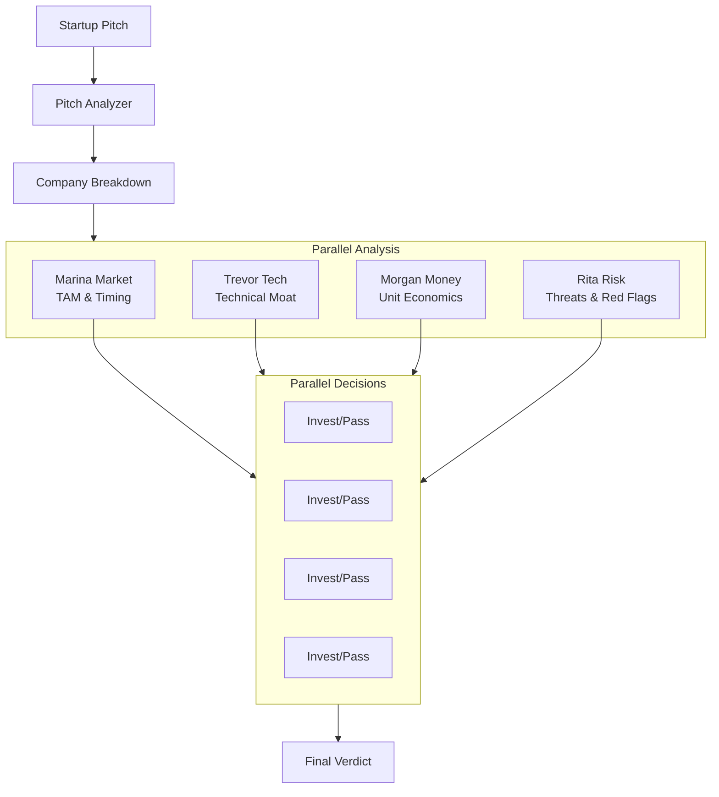
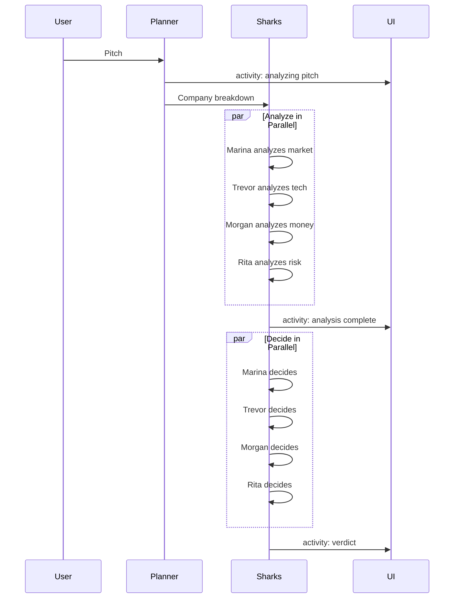
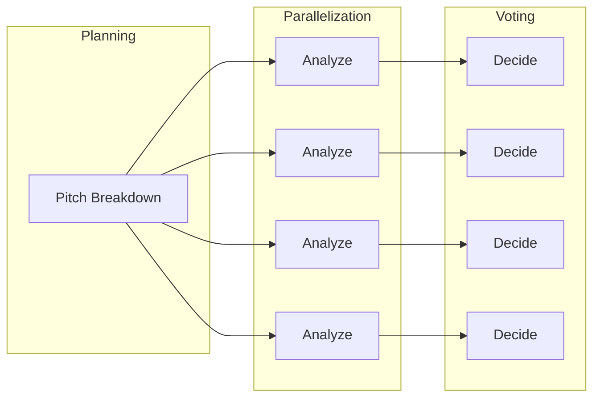

# Shark Tank Room

**Pattern**: Planning + Parallelization + Voting
**Purpose**: Pitch your startup to 4 AI investors who analyze and decide

## How It Works



## The Sharks

| Shark | Focus Area | Evaluation Criteria |
|-------|------------|---------------------|
| **Marina Market** | Market | TAM, timing, competition |
| **Trevor Tech** | Technology | Technical moat, scalability |
| **Morgan Money** | Financials | Unit economics, margins, runway |
| **Rita Risk** | Risk | Threats, red flags, dependencies |

## Execution Flow



## Example Session

**Pitch**: "An app that matches dog owners for neighborhood playdates"

**Company Breakdown**:
- Name: DogMeet
- One-liner: "Tinder for dog playdates"
- Ask: $500K for 10%

**Shark Analyses**:

**Marina Market**:
> "Pet care is a $100B+ market. Dog ownership surged post-COVID. But this is a lifestyle app competing for attention with established platforms. Market timing is good, but differentiation is unclear."
> Rating: 6/10

**Trevor Tech**:
> "Location-based matching is commoditized. No technical moat. Could be cloned in weeks. Need unique data or algorithms to defend."
> Rating: 4/10

**Morgan Money**:
> "Freemium model typical for social apps. LTV depends on engagement which is unpredictable. Customer acquisition in crowded pet space is expensive."
> Rating: 5/10

**Rita Risk**:
> "Liability for dog interactions is significant. Safety incidents could tank the brand. Seasonal usage patterns. High churn risk."
> Rating: 3/10

**Investment Decisions**:
- Marina: PASS - "Market is there but no moat"
- Trevor: PASS - "Too easy to copy"
- Morgan: PASS - "Unit economics don't work"
- Rita: PASS - "Too much liability risk"

**Verdict**: NO DEAL

## AG-UI Activities

```python
# Analysis phase
emitter.update_activity("shark_tank", {
    "status": "analyzing",
    "phase": "parallel_analysis",
    "pitch": pitch,
    "company": "DogMeet",
    "one_liner": "Tinder for dog playdates",
    "sharks": [
        {"name": "Marina Market", "focus": "Market", "status": "analyzing"},
        {"name": "Trevor Tech", "focus": "Technology", "status": "analyzing"},
        {"name": "Morgan Money", "focus": "Financials", "status": "analyzing"},
        {"name": "Rita Risk", "focus": "Risks", "status": "analyzing"},
    ],
}, activity_id)

# Decision phase
emitter.update_activity("shark_tank", {
    "status": "deciding",
    "phase": "investment_decisions",
    "analyses": [
        {"shark": "Marina Market", "rating": 6, "summary": "..."},
        ...
    ],
}, activity_id)

# Final verdict
emitter.update_activity("shark_tank", {
    "status": "complete",
    "phase": "complete",
    "verdict": "NO DEAL",
    "sharks": [...],
    "analyses": [...],
    "deals": [
        {"shark": "Marina", "decision": "PASS", "reason": "..."},
        ...
    ],
    "investors": [],
    "num_investors": 0,
    "total_investment": 0,
    "total_equity": 0,
}, activity_id)
```

## Configuration

```yaml
id: "shark-tank"
name: "Shark Tank"
description: "Pitch your startup to 4 AI sharks who analyze and decide whether to invest"

welcome_message: |
  Welcome to the Shark Tank!

  Pitch your startup idea and face our panel of sharks:

  - **Marina Market** - The Market Maven
  - **Trevor Tech** - The Tech Titan
  - **Morgan Money** - The Money Mogul
  - **Rita Risk** - The Risk Ranger

  Each shark will analyze your pitch, then decide whether to invest!

agent:
  kind: "factory"
  factory_name: "crazy_glue.factories.shark_tank_factory.create_shark_tank_agent"
  with_agent_config: true
  extra_config:
    model_name: "gpt-oss:20b"

suggestions:
  - "An app that matches dog owners for neighborhood playdates"
  - "AI-powered personal stylist that works with your existing wardrobe"
  - "Subscription service for locally-sourced office snacks"
  - "Platform connecting retirees with startups for mentorship"
  - "Smart trash can that automatically sorts recycling"
```

## Pydantic Models

```python
class PitchBreakdown(pydantic.BaseModel):
    company_name: str
    one_liner: str
    problem: str
    solution: str
    target_market: str
    business_model: str
    ask: str


class SharkAnalysis(pydantic.BaseModel):
    shark_name: str
    focus_area: str
    analysis: str
    rating: int = pydantic.Field(ge=1, le=10)
    key_concerns: list[str]
    positives: list[str]


class InvestmentDecision(pydantic.BaseModel):
    shark_name: str
    decision: typing.Literal["INVEST", "PASS"]
    amount: int | None
    equity: float | None
    reasoning: str
```

## Use Cases

- **Startup validation**: Test pitch against tough critics
- **Learning**: Understand investor perspectives
- **Presentation practice**: Refine your pitch
- **Market research**: Multi-angle analysis

## Patterns Demonstrated

This room combines three agentic patterns:

1. **Planning**: Break down pitch into structured components
2. **Parallelization**: All 4 sharks analyze simultaneously
3. **Voting**: Each shark makes independent investment decision



## Related Patterns

- **Brainstorm Arena**: Similar multi-persona approach
- **Debate**: Two-sided evaluation
- **Planning**: Goal decomposition component
