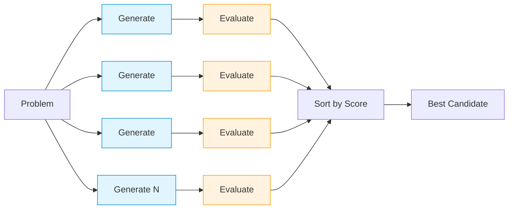
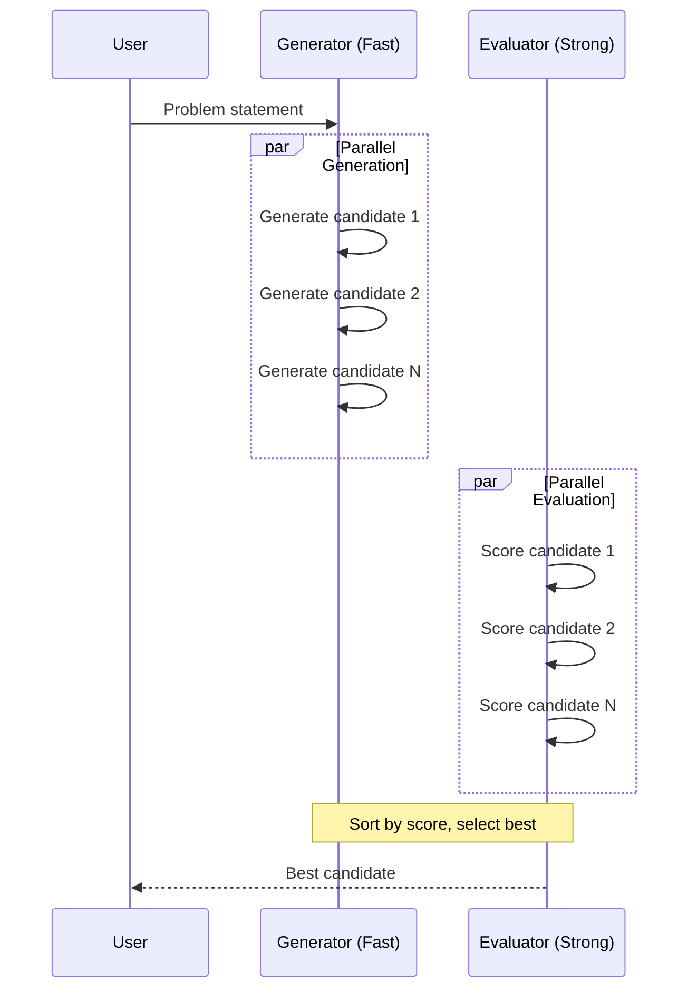

# Thought Candidates Room

**Pattern**: Thought Candidates (17a - Best-of-N Sampling)
**Purpose**: Generate multiple candidate solutions and select the best

## How It Works



**Model Tiers:**

- **Generate** (blue): Fast model for quick candidate generation
- **Evaluate** (orange): Strong model for quality scoring

## Best-of-N Flow



## Example Session

**Problem**: "How would you explain recursion to a beginner?"

**Candidates Generated**:

1. **Score 8.5/10** (Best)
   - Approach: Russian nesting dolls analogy
   - Reasoning: Each doll contains a smaller doll, until the smallest

2. **Score 7.2/10**
   - Approach: Mirror facing mirror analogy
   - Reasoning: Infinite reflection demonstrates self-reference

3. **Score 5.1/10** (Invalid)
   - Approach: Loop explanation
   - Reasoning: Misses the self-referential nature

**Result**: Russian nesting dolls selected as best approach

## AG-UI Activities

Activity updates show generation and evaluation progress:

```python
emitter.update_activity("thought_candidates", {
    "status": "generating",
    "num_candidates": 5,
    "problem": "How would you explain...",
}, activity_id)

emitter.update_activity("thought_candidates", {
    "status": "evaluating",
    "n": 5,
}, activity_id)

emitter.update_activity("thought_candidates", {
    "status": "complete",
    "num_candidates": 5,
    "best_score": 8.5,
    "problem": "How would you explain...",
}, activity_id)
```

## Configuration

```yaml
id: "thought-candidates"
name: "Thought Candidates"
description: "Generate multiple candidate solutions and pick the best"

agent:
  kind: "factory"
  factory_name: "crazy_glue.factories.thought_candidates_factory.create_thought_candidates_agent"
  with_agent_config: true
  extra_config:
    # Number of candidates to generate (more = better quality, higher cost)
    num_candidates: 5

    # Maximum words per response (lower for local models)
    max_words: 100

    # Optional constraints applied to all problems
    constraints: []
    # Example:
    # constraints:
    #   - "Consider performance implications"
    #   - "Prefer simple solutions"

suggestions:
  - "How would you explain recursion to a beginner?"
  - "What's the best approach to refactor a monolithic app?"
  - "Design a caching strategy for a high-traffic API"
```

## Pattern Implementation

The room uses the `run_best_of_n` function from `agentic_patterns.thought_candidates`:

```python
from agentic_patterns.thought_candidates import (
    run_best_of_n,
    ProblemStatement,
    OutputConfig,
)

problem = ProblemStatement(
    description=user_prompt,
    constraints=["Consider performance implications"],
)

output_config = OutputConfig(max_words=100, ascii_only=True)

result = await run_best_of_n(problem, n=5, config=output_config)

# result.candidates - all candidates sorted by score
# result.best - highest scoring candidate
# result.best.score - score 0-10
# result.best.thought.content - the approach
# result.best.evaluation.feedback - evaluator's feedback
```

## When to Use

**Good for:**
- Problems with multiple valid solutions
- When you want to compare approaches
- Self-consistency checks on reasoning
- Improving quality over single-shot generation

**Not ideal for:**
- Simple queries that single-shot handles well
- Purely subjective tasks with no scoring criteria
- Tight latency/cost budgets (2N LLM calls)

## Cost Considerations

- Each candidate requires 2 LLM calls (generate + evaluate)
- N candidates = 2N total calls
- Quality gains plateau beyond N=5-10 for most problems
- Start with N=3-5 and increase only if needed

## Related Patterns

- **Tree of Thoughts**: Extends this pattern with multi-level exploration (17b)
- **Parallelization**: Uses `asyncio.gather` for concurrent execution
- **Reflection**: Similar concept of self-evaluation
