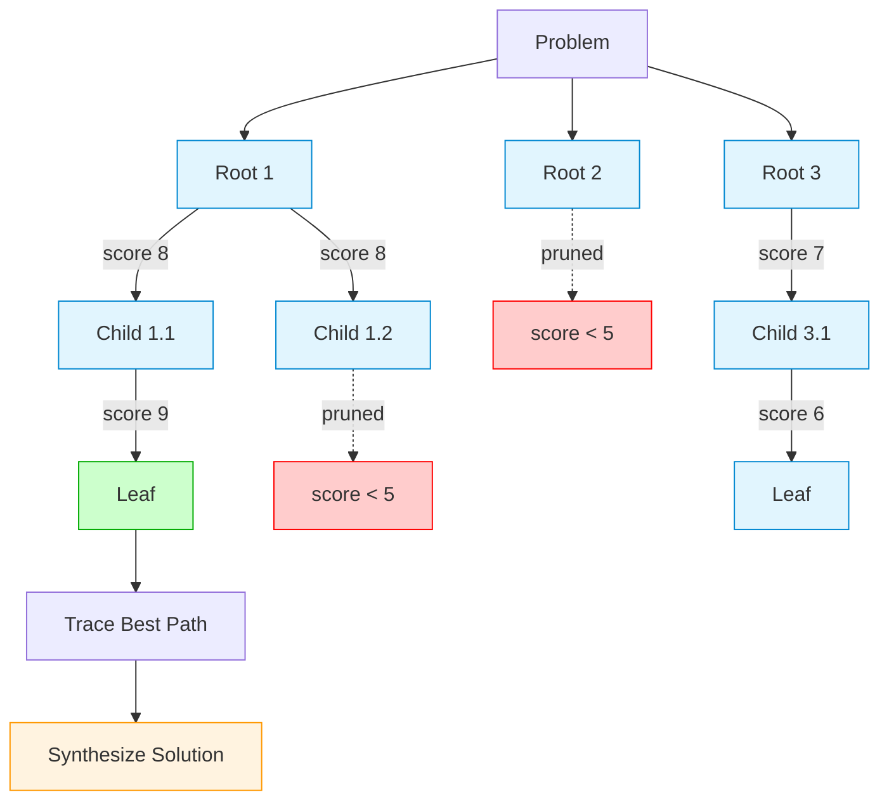
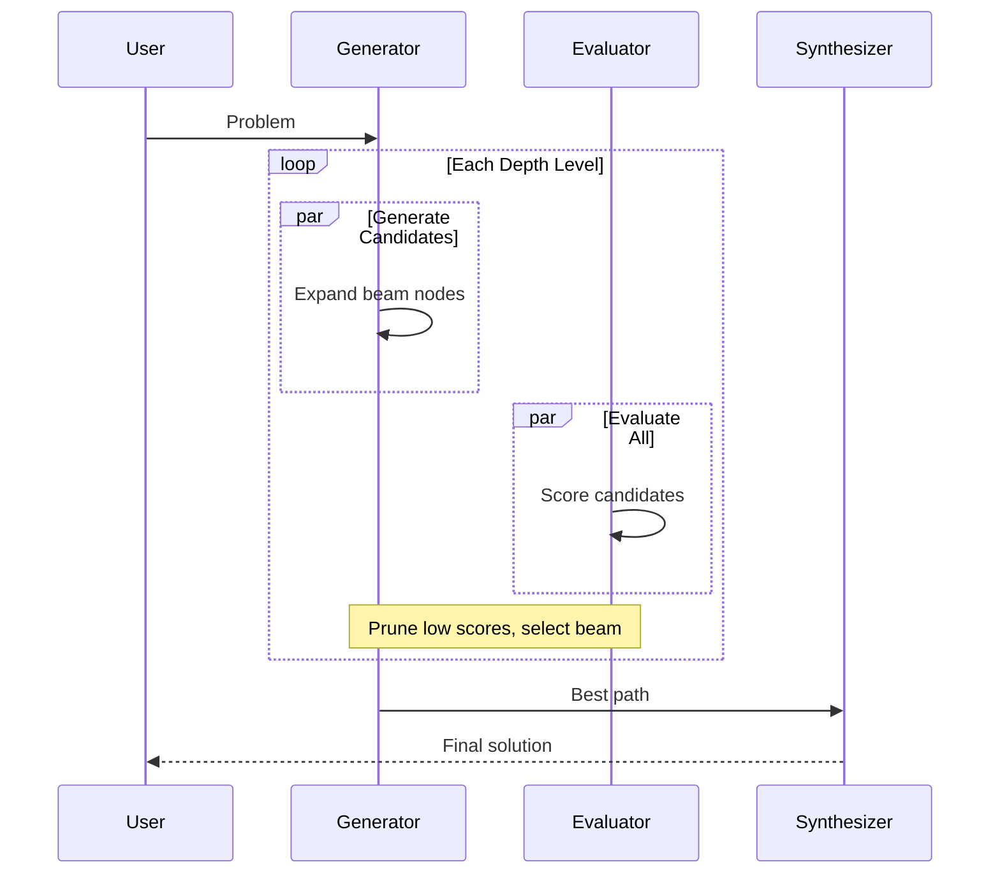

# Tree of Thoughts Room

**Pattern**: Tree of Thoughts (17b - Multi-level Exploration)
**Purpose**: Deep exploration with pruning for complex reasoning

## How It Works



**Legend:**
- **Blue nodes**: Active exploration
- **Green node**: Best path endpoint
- **Red nodes**: Pruned (low-scoring)
- **Orange**: Final synthesis

## Beam Search Flow



## Example Session

**Problem**: "A web app is responding slowly. Response times increased from 200ms to 3s."

**Tree Exploration**:

```
Depth 0 (Roots):
  * [8.2] Check database query performance
    [7.1] Investigate application bottlenecks
    [4.2] Check DNS resolution (pruned)

Depth 1:
  * [8.5] Run EXPLAIN, check missing indexes
    [6.1] Review connection pool settings
    [6.8] Profile endpoint handlers

Depth 2:
  * [9.0] Found N+1 query pattern in orders endpoint
```

**Best Path**:
1. Check database query performance (8.2)
2. Run EXPLAIN, check missing indexes (8.5)
3. Found N+1 query pattern (9.0)

**Synthesized Solution**:
> "Start by analyzing the orders endpoint. The N+1 query pattern is causing
> exponential database calls. Add eager loading for order items to reduce
> queries from O(n) to O(1)."
>
> Confidence: 85%

## AG-UI Activities

```python
emitter.update_activity("tree_of_thoughts", {
    "status": "starting",
    "max_depth": 3,
    "branch_factor": 3,
    "problem": "A web app is responding...",
}, activity_id)

emitter.update_activity("tree_of_thoughts", {
    "status": "exploring",
    "max_depth": 3,
    "current_depth": 1,
}, activity_id)

emitter.update_activity("tree_of_thoughts", {
    "status": "synthesizing",
    "nodes_explored": 15,
    "nodes_pruned": 4,
}, activity_id)

emitter.update_activity("tree_of_thoughts", {
    "status": "complete",
    "nodes_explored": 15,
    "nodes_pruned": 4,
    "best_path_length": 3,
    "confidence": 0.85,
}, activity_id)
```

## Configuration

```yaml
id: "tree-of-thoughts"
name: "Tree of Thoughts"
description: "Multi-level exploration with pruning for complex reasoning"

agent:
  kind: "factory"
  factory_name: "crazy_glue.factories.tree_of_thoughts_factory.create_tree_of_thoughts_agent"
  with_agent_config: true
  extra_config:
    # Tree exploration parameters
    max_depth: 3          # How many levels deep to explore (1-10)
    branch_factor: 3      # Candidates per node (1-10)
    prune_threshold: 5.0  # Minimum score to continue expanding (0-10)
    beam_width: 2         # Top-k nodes to expand per level

    # Output constraints
    max_words: 100        # Max words per thought

    # Optional problem constraints
    constraints: []

suggestions:
  - "A web app is responding slowly. What are the likely causes?"
  - "How should I migrate from a monolith to microservices?"
  - "Design a fault-tolerant distributed cache system"
```

## Tree Configuration

| Parameter | Default | Description |
|-----------|---------|-------------|
| `max_depth` | 3 | How deep to explore (levels) |
| `branch_factor` | 3 | Candidates generated per node |
| `prune_threshold` | 5.0 | Minimum score to expand (0-10) |
| `beam_width` | 2 | Top-k nodes expanded per level |

### Cost Estimation

| Config | Nodes | LLM Calls | Use Case |
|--------|-------|-----------|----------|
| depth=2, branch=2, beam=2 | ~6 | ~13 | Quick exploration |
| depth=3, branch=3, beam=2 | ~15 | ~31 | Balanced |
| depth=3, branch=4, beam=3 | ~39 | ~79 | Thorough analysis |

*Each node = 2 calls (generate + evaluate). Plus 1 synthesis call.*

## Pattern Implementation

```python
from agentic_patterns.thought_candidates import ProblemStatement, OutputConfig
from agentic_patterns.tree_of_thoughts import TreeConfig, run_tree_of_thoughts

problem = ProblemStatement(
    description="Why is the app slow?",
    constraints=["Consider database, app, and infrastructure layers"],
)

tree_config = TreeConfig(
    max_depth=3,
    branch_factor=3,
    prune_threshold=5.0,
    beam_width=2,
)

output_config = OutputConfig(max_words=100, ascii_only=True)

result = await run_tree_of_thoughts(problem, tree_config, output_config)

# result.all_nodes - complete tree structure
# result.best_path - nodes forming the best path
# result.solution.solution - synthesized answer
# result.solution.confidence - 0.0 to 1.0
# result.nodes_explored - total nodes generated
# result.nodes_pruned - nodes below threshold
```

## When to Use

**Good for:**
- Diagnostic reasoning ("why is X happening?")
- Multi-step planning and strategy
- Problems where greedy approaches fail
- Architecture decisions with trade-offs

**Not ideal for:**
- Open-ended chat or creative writing
- Simple queries single-shot handles well
- Tight latency budgets (10-100x slower)
- Tasks without evaluable correctness criteria

## Key Concepts

### Beam Search
Only the top-k (beam_width) nodes at each level are expanded. This focuses
computation on promising paths while limiting exponential growth.

### Pruning
Nodes scoring below `prune_threshold` are marked as pruned and not expanded.
Aggressive pruning saves cost but may discard the optimal path.

### Path Synthesis
After exploration, the best path (root to highest-scoring leaf) is extracted
and synthesized into a coherent solution by the strong model.

## Related Patterns

- **Thought Candidates**: Foundation pattern (17a) - single level
- **Planning**: Goal decomposition (ToT is exploration, not execution)
- **Reflection**: Self-evaluation loop (ToT evaluates at each node)
